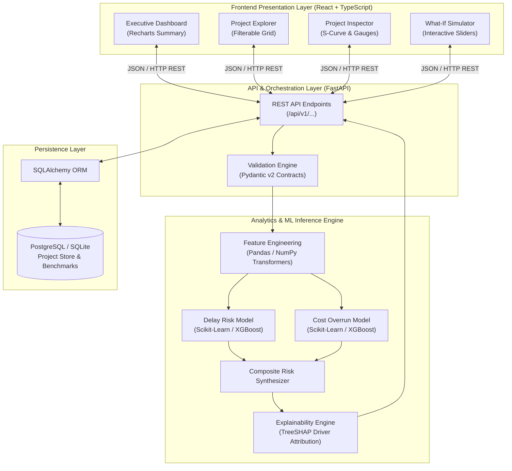

# System Architecture Specification

## 1. System Overview & Architecture Diagram
The architecture for **SIH26103** is designed as a modular, decoupled, modern web-based predictive analytics platform. It separates presentation, API orchestration, ML inference, and data persistence to guarantee maintainability, testability, and demo reliability.



---

## 2. Layer & Component Breakdown

### 2.1 Frontend Presentation Layer (React + TypeScript)
- **Role:** Deliver a high-impact, responsive, government-executive grade dashboard.
- **Key Modules:**
  - `ExecutiveSummary`: KPI cards (Total Capital Monitored, Projects at Critical Delay Risk, Cost Escalation Exposure, High-Risk Heatmap).
  - `ProjectExplorer`: Searchable, filterable data table with status pills, sector filters, and state tags.
  - `ProjectInspector`: In-depth analytical view for a selected project displaying milestone timeline, EVM curves, and risk breakdown.
  - `WhatIfSimulator`: Real-time reactive simulator with interactive sliders (e.g., adjusting physical progress, land clearance status) triggering dynamic API re-scoring.
- **Tech Choices (Provisional):** React 18, TypeScript, Tailwind CSS, Recharts, Lucide Icons.

### 2.2 Backend API Layer (FastAPI + Python)
- **Role:** Expose standardized, secure, type-safe REST endpoints.
- **Key Endpoints:**
  - `GET /api/v1/health`: System health and model readiness probe.
  - `GET /api/v1/projects`: Retrieve paginated/filtered list of monitored projects.
  - `GET /api/v1/projects/{id}`: Detailed metadata, history, and risk assessment for a specific project.
  - `POST /api/v1/predict`: Single-project on-the-fly inference and explainability evaluation.
  - `POST /api/v1/predict/batch`: Ingestion of multiple project records (CSV/JSON upload).
  - `GET /api/v1/portfolio/summary`: Aggregated portfolio analytics and alert distribution.
- **Validation:** Enforced via Pydantic v2 data models for request and response payloads.

### 2.3 Analytics & ML Inference Engine
- **Role:** Execute deterministic feature transformations, run pre-trained ML models, compute composite risk index, and generate explainability breakdowns.
- **Subcomponents:**
  1. `FeatureTransformer`: Computes schedule slippage, cost burn ratio, time-elapsed ratio, and clearance bottlenecks.
  2. `PredictorService`: Loads serialized model artifacts (`.joblib` / ONNX) and executes inference.
  3. `ExplainabilityService`: Calculates SHAP values and translates top mathematical drivers into human-readable governance summaries.
  4. `AlertEngine`: Maps composite scores into standardized alert tiers (`Normal`, `Watchlist`, `High Alert`, `Critical Red Flag`) with prescriptive recommendations.

### 2.4 Persistence Layer (SQLAlchemy + Database)
- **Role:** Persist project records, audit history, milestone logs, and benchmark presets.
- **Strategy:**
  - **Production / Docker Target:** PostgreSQL.
  - **Local Development / Standalone Demo Fallback:** SQLite (via SQLAlchemy abstraction) to guarantee zero-install, zero-network-failure execution during live jury evaluation.

---

## 3. End-to-End Data Flow Sequence

1. **Input Submission:**
   - User inputs parameters via Web Form or selects a Preloaded Project from the dashboard.
2. **Payload Validation:**
   - FastAPI receives JSON; Pydantic validates data types, date constraints, and non-negative financial values.
3. **Feature Generation:**
   - Feature transformer computes temporal durations, progress-to-time ratios, and cost burn metrics.
4. **Predictive Scoring:**
   - Model inference executes for Delay Risk and Cost Overrun Risk.
   - Composite risk index is synthesized.
5. **Explainability Extraction:**
   - SHAP TreeExplainer attributes local contributions; top 3-5 drivers are isolated.
6. **Alert Categorization:**
   - Alert threshold rules assign risk level badge and generate actionable mitigation guidance.
7. **Response Delivery:**
   - Unified JSON payload returned to React frontend; UI components update dynamically with animations and color-coded risk indicators.

---

## 4. Planned Project Repository Structure

```
SIH26103-Infrastructure-Risk-Prediction/
├── .gitignore
├── README.md
├── PROJECT_CONTEXT.md
├── MVP_REQUIREMENTS.md
├── DATA_SCHEMA.md
├── ML_PLAN.md
├── ARCHITECTURE.md
├── DEVELOPMENT_LOG.md
│
├── backend/
│   ├── app/
│   │   ├── api/             # FastAPI routers & endpoints
│   │   ├── core/            # Config, security, logging
│   │   ├── models/          # SQLAlchemy database models
│   │   ├── schemas/         # Pydantic request/response schemas
│   │   ├── services/        # Business logic & orchestration
│   │   ├── ml/              # Model loaders, transformers, SHAP explainers
│   │   └── main.py          # Application entrypoint
│   ├── tests/               # Backend unit and integration tests
│   └── requirements.txt     # Python backend dependencies
│
├── frontend/
│   ├── src/
│   │   ├── assets/          # Icons, logos, styles
│   │   ├── components/      # UI components (cards, tables, charts)
│   │   ├── pages/           # Dashboard, Project Detail, Simulator
│   │   ├── services/        # API client bindings
│   │   ├── types/           # TypeScript interfaces conforming to backend schemas
│   │   └── App.tsx
│   ├── package.json
│   └── vite.config.ts
│
├── ml_research/             # Offline data preparation, training notebooks, benchmarks
│   ├── data/                # Raw & processed benchmark datasets
│   ├── notebooks/           # Exploratory data analysis & model tuning
│   ├── artifacts/           # Serialized trained models (.joblib)
│   └── generate_benchmark.py # Calibrated synthetic project generator
│
└── docker/                  # Dockerfiles & docker-compose configurations
```

---

## 5. Architectural Quality Attributes & Non-Functional Decisions

| Attribute | Architectural Tactic |
|---|---|
| **Determinism** | Model inference uses frozen serialized pipelines with fixed random seeds; given the same input, the system produces identical risk outputs. |
| **Decoupling** | Strict Pydantic contracts ensure frontend and backend can be tested and developed independently with mocked API contracts. |
| **Portability** | Multi-stage Docker Compose ensures that the entire stack (FastAPI + React + DB) can be spun up on any judge's machine with a single command (`docker compose up`). |
| **Fault Isolation** | If the ML inference engine encounters an edge case, graceful fallback to standard EVM heuristic scoring prevents frontend crashes. |
