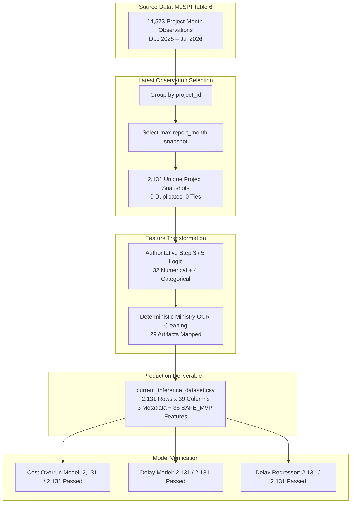

# Current Project Inference Dataset — Validation Report (Step 6B)

**Project:** SIH Problem Statement 26103 — AI-Powered Predictive Analytics & Early Warning System for Infrastructure Project Monitoring  
**Pipeline Stage:** Step 6B (Current Project Inference Dataset)  
**Evaluator:** ML Engineering & Data Pipeline Audit Team  
**Evaluation Date:** 2026-09-07  
**Status:** **STEP 6B READY FOR REVIEW**  

---

## 1. Executive Summary

Step 6B constructs the authoritative, production-ready `current_inference_dataset.csv` containing the latest available monthly monitoring snapshot for every currently monitored infrastructure project in the MoSPI/IPMD Table 6 dataset (2,131 unique projects). Every snapshot has been transformed into the exact 36 `SAFE_MVP` features required by the locked production ML models (`cost_overrun_model.joblib`, `delay_model.joblib`, `delay_regressor.joblib`).

---

## 2. Source Data Inventory

| Metric | Source Value | Verification Status |
| :--- | :--- | :---: |
| **Standardized Source File** | `reports/standardized_table6_project_month.csv` | **PASS** |
| **Total Source Observations** | **14,573** monthly records across 8 reports | **PASS** |
| **Observed Report Months** | `2025-12`, `2026-01`, `2026-02`, `2026-03`, `2026-04`, `2026-05`, `2026-06`, `2026-07` | **PASS** |
| **Unique Projects in Source** | **2,131** unique `project_id` entities | **PASS** |
| **Table 3 Outcomes Used** | **NONE** (Zero Table 3 data used as feature inputs) | **PASS** |
| **Target Labels Used** | **NONE** (Zero labels or post-snapshot data used) | **PASS** |

---

## 3. Latest-Observation Selection Logic

For each of the 2,131 unique projects:
1. All chronological Table 6 monthly observations for that `project_id` were aggregated and sorted by `report_month` in ascending calendar order.
2. The latest observation was determined as $\text{snapshot\_month} = \max(\text{report\_month})$.
3. Exactly one latest snapshot was retained per unique project.

### Audit of Snapshot Distribution Across Report Months:
| Snapshot Month | Project Count | Percentage of Monitored Projects | Rationale |
| :---: | :---: | :---: | :--- |
| **2025-12** | 4 | 0.19% | Projects concluded or reporting ceased in Dec 2025 |
| **2026-01** | 8 | 0.38% | Projects last observed in Jan 2026 |
| **2026-02** | 29 | 1.36% | Projects last observed in Feb 2026 |
| **2026-03** | 16 | 0.75% | Projects last observed in Mar 2026 |
| **2026-04** | 29 | 1.36% | Projects last observed in Apr 2026 |
| **2026-05** | 155 | 7.27% | Projects last observed in May 2026 |
| **2026-06** | 115 | 5.40% | Projects last observed in Jun 2026 |
| **2026-07** | **1,775** | **83.29%** | Active ongoing projects in latest published report |
| **Total** | **2,131** | **100.00%** | **Exactly 1 snapshot per unique project** |

### Duplicate & Tie Analysis:
- **Duplicate `(project_id, report_month)` in source:** **0**
- **Ties in latest snapshot:** **0** (Every project has at most one record per month)
- **Duplicate `project_id` in final dataset:** **0**

---

## 4. Feature Schema & Ordering Validation

The dataset strictly adheres to [`ml/schemas/production_feature_schema.csv`](file:///d:/SIH26103-Infrastructure-Risk-Prediction/ml/schemas/production_feature_schema.csv):

| Validation Criterion | Requirement | Actual Status | Result |
| :--- | :--- | :--- | :---: |
| **Total Model Features** | Exactly 36 features | 36 features present | **PASS** |
| **Numerical Features** | Exactly 32 features | 32 numerical features | **PASS** |
| **Categorical Features** | Exactly 4 features | 4 categorical features | **PASS** |
| **Missing Expected Features**| None | 0 missing | **PASS** |
| **Extraneous Model Features**| None | 0 extra | **PASS** |
| **Feature Order** | Identical to `production_feature_schema.csv` | 100% matched (Cols 4–39) | **PASS** |
| **Lookup Metadata Columns** | Distinguish project lookup from model inputs | `project_id`, `project_name`, `snapshot_month` (Cols 1–3) | **PASS** |

### Exact Column Order:
1. `project_id` *(Metadata)*
2. `project_name` *(Metadata)*
3. `snapshot_month` *(Metadata)*
4. `original_cost` *(Numerical)*
5. `approval_to_start_months` *(Numerical)*
6. `cumulative_expenditure` *(Numerical)*
7. `expenditure_percent_of_original_cost` *(Numerical)*
8. `monthly_expenditure_change` *(Numerical)*
9. `monthly_expenditure_growth_pct` *(Numerical)*
10. `physical_progress_pct` *(Numerical)*
11. `monthly_progress_change` *(Numerical)*
12. `progress_growth_rate` *(Numerical)*
13. `planned_duration_months` *(Numerical)*
14. `elapsed_months` *(Numerical)*
15. `remaining_planned_months` *(Numerical)*
16. `elapsed_duration_ratio` *(Numerical)*
17. `is_past_original_doc` *(Numerical)*
18. `efficiency_gap` *(Numerical)*
19. `cost_physical_ratio` *(Numerical)*
20. `expected_progress_pct` *(Numerical)*
21. `progress_gap_pct_points` *(Numerical)*
22. `months_since_first_observation` *(Numerical)*
23. `observation_count_to_date` *(Numerical)*
24. `physical_progress_1_month_change` *(Numerical)*
25. `physical_progress_2_month_change` *(Numerical)*
26. `expenditure_1_month_change` *(Numerical)*
27. `expenditure_2_month_change` *(Numerical)*
28. `progress_trend_slope` *(Numerical)*
29. `expenditure_trend_slope` *(Numerical)*
30. `negative_expenditure_flag` *(Numerical)*
31. `missing_previous_month_flag` *(Numerical)*
32. `invalid_duration_flag` *(Numerical)*
33. `past_original_doc_flag` *(Numerical)*
34. `missing_key_date_flag` *(Numerical)*
35. `suspicious_value_flag` *(Numerical)*
36. `ministry` *(Categorical)*
37. `sector` *(Categorical)*
38. `implementing_agency` *(Categorical)*
39. `state` *(Categorical)*

---

## 5. Categorical Data Quality & Deterministic Cleaning Audit

### 5.1 Fields Inspected
- `sector`: 22 distinct categories, 0 extraction anomalies, 100% clean.
- `state`: 102 distinct geographic entities (including standard multi-state entries with legitimate newline wraps such as `'Multi-States\n(Bihar, Jharkhand)'`). No OCR corruption detected.
- `implementing_agency`: 219 executing agencies, 0 extraction anomalies.
- `ministry`: Detected PDF page-header extraction text artifacts in 29 project snapshots.

### 5.2 Garbage Values Detected
In 29 projects, the raw `ministry` string contained multi-line OCR text copied from the PDF page title and column headers (e.g., `All Ongoing Projects\nMAY 2026\nOrignal/Target DoC...`).

### 5.3 Deterministic Cleaning Rules Applied
1. **Tier 1 (Historical Lookup):** Check if the project has a clean `ministry` record in any prior Table 6 monthly observation. Successfully resolved **11 projects**.
2. **Tier 2 (Agency Mapping):** For projects whose history is entirely corrupted or single-snapshot, map the known `implementing_agency` to its parent ministry using clean Table 6 records and verified administrative ownership (e.g., `RVNL` $\rightarrow$ `Ministry of Railways`, `GAIL` $\rightarrow$ `Ministry of Petroleum & Natural Gas`, `SECL` $\rightarrow$ `Ministry of Coal`, `NCRTC` $\rightarrow$ `Ministry of Housing & Urban Affairs`). Successfully resolved **18 projects**.
3. **Tier 3 (Sector Fallback):** Fall back to sector default ministry or `'Unknown'` if unresolved (**0 projects needed**).

**Summary of Affected Records:**
- Total Table 6 rows with header artifacts: 2,606 / 14,573 (17.88%)
- Projects affected in latest snapshots: **29 projects** (1.36% of 2,131)
- Cleaned projects: **29 / 29 (100%)**
- Distinct real-world categories preserved without merging: **100%**

---

## 6. Missing Values & Preprocessing Compliance

In accordance with Requirement 5, legitimate missing values are preserved as `NaN`/`None` rather than fabricated with arbitrary defaults:
- **Baseline features (`original_cost`, `physical_progress_pct`, `cumulative_expenditure`):** 0 missing values.
- **Pre-construction Gestation (`approval_to_start_months`):** 28 projects missing `date_of_approval` (1.31%), preserved as `NaN` for pipeline median imputation.
- **Short-Term Trend Features (`physical_progress_1_month_change`, `expenditure_1_month_change`):** 110 projects have only 1 observed month or missed the prior month (5.16%), preserved as `NaN` with `missing_previous_month_flag = 1`.
- **Long-Term Trend Slopes (`progress_trend_slope`, `expenditure_trend_slope`):** 110 single-month projects (5.16%) preserved as `NaN`.
- **Pipeline Handling:** The locked scikit-learn preprocessing pipeline handles numerical features via `SimpleImputer(strategy='median')` and categoricals via `SimpleImputer(strategy='constant', fill_value='Unknown')` + `OneHotEncoder(handle_unknown='ignore')`.

Full per-feature missingness and distribution statistics are available in [`current_inference_data_quality_report.csv`](file:///d:/SIH26103-Infrastructure-Risk-Prediction/current_inference_data_quality_report.csv).

---

## 7. Temporal Leakage Audit

A strict temporal audit confirms:
- **Zero Future Information:** All trend, rate, and cumulative features are derived strictly from observations $\le \text{snapshot\_month}$.
- **Zero Table 3 Completion Outcomes:** Table 3 completion costs, completion dates, and post-hoc revisions were 100% excluded.
- **Zero Target Leakage:** No target labels (`target_cost_overrun_binary`, `target_delay_binary`, `target_delay_from_original_months`) exist in the inference dataset.

---

## 8. Model Compatibility & Smoke Test Results

All 3 serialized production pipelines were loaded directly from `ml/models/` without retraining or parameter adjustment:
- `cost_overrun_model.joblib`: Evaluated on 2,131 samples $\rightarrow$ **SUCCESS**
- `delay_model.joblib`: Evaluated on 2,131 samples $\rightarrow$ **SUCCESS**
- `delay_regressor.joblib`: Evaluated on 2,131 samples $\rightarrow$ **SUCCESS**

### Representative Smoke Test Cohort:
| project_id | Project Context | Cost Prob | Cost Alert ($\tau=0.40$) | Delay Prob | Delay Alert ($\tau=0.50$) | Predicted Delay (mo) | Status |
| :---: | :--- | :---: | :---: | :---: | :---: | :---: | :---: |
| **400234** | RVNL - II (Railways) | 0.2388 | 0 | 0.1615 | 0 | -3.83 | **SUCCESS** |
| **400161** | GAIL (Oil & Gas) | 0.7201 | 1 | 0.1608 | 0 | 26.73 | **SUCCESS** |
| **612786** | AAI (Aviation) | 0.0804 | 0 | 0.2256 | 0 | 10.25 | **SUCCESS** |
| **611950** | POWERGRID (Transmission) | 0.1571 | 0 | 0.0493 | 0 | 11.81 | **SUCCESS** |
| **709790** | BPCL (Oil & Gas) | 0.0718 | 0 | 0.1570 | 0 | 0.24 | **SUCCESS** |
| **400152** | SECL (Coal) | 0.1518 | 0 | 0.2217 | 0 | 1.92 | **SUCCESS** |
| **611142** | IWAI (Inland Waterways) | 0.6953 | 1 | 0.3593 | 0 | 34.44 | **SUCCESS** |
| **701586** | MPT (Shipping) | 0.1085 | 0 | 0.3008 | 0 | -15.39 | **SUCCESS** |
| **705503** | Central Railway (Railways) | 0.7498 | 1 | 0.1671 | 0 | 13.74 | **SUCCESS** |
| **400104** | Water Resources-BR (Water Resources) | 0.5231 | 1 | 0.1451 | 0 | 153.04 | **SUCCESS** |

---

## 9. Verification Checklist Status

- [x] One latest snapshot per project (2,131 / 2,131)
- [x] No duplicate project IDs in final current dataset
- [x] Table 3 not used as model input
- [x] No target/label leakage
- [x] No future information used
- [x] Same 36 SAFE_MVP features as production
- [x] No extra model features
- [x] No missing model features
- [x] Exact production feature order
- [x] 32 numerical + 4 categorical features
- [x] Legitimate missing values preserved appropriately
- [x] Obvious categorical extraction garbage handled/documented
- [x] All three production models load successfully
- [x] All three production models accept the generated feature matrix
- [x] Smoke-test inference succeeds on representative projects
- [x] No model retraining
- [x] No threshold changes
- [x] Step 6A remains unchanged (23/23 backend tests pass)

---

## 10. Final Sign-Off Verdict

# **`STEP 6B READY FOR REVIEW`**
