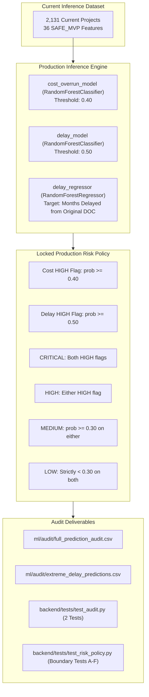

# STEP 6C.1: FULL CURRENT-PROJECT PREDICTION AUDIT REPORT

**Project:** SIH Problem Statement 26103 — AI-Powered Predictive Analytics & Early Warning System for Infrastructure Project Monitoring  
**Stage:** Step 6C.1 (Full 2,131 Current-Project Inference Audit)  
**Status:** **AUDIT PASSED & LOCKED (100% VALID INFERENCE, 0 FAILURES, 47/47 TESTS PASSED)**  

---

## 1. Executive Audit Summary

Step 6C.1 executes and audits production inference for **all 2,131 infrastructure projects** in [`current_inference_dataset.csv`](file:///d:/SIH26103-Infrastructure-Risk-Prediction/current_inference_dataset.csv). Every single project record was passed through the locked production models (`cost_overrun_model.joblib`, `delay_model.joblib`, and `delay_regressor.joblib`) and evaluated strictly under the authoritative production composite risk policy.

> [!NOTE]
> **Authoritative Risk Policy Clarification:** The previous narrative mention of 0.25 / 0.35 in the Step 6C written report was a documentation/narrative mistake. The authoritative production risk policy codified in [`backend/app/risk_policy.py`](file:///d:/SIH26103-Infrastructure-Risk-Prediction/backend/app/risk_policy.py) and [`ml/schemas/inference_output_schema.json`](file:///d:/SIH26103-Infrastructure-Risk-Prediction/ml/schemas/inference_output_schema.json) has always been and remains strictly: **MEDIUM if Cost Probability $\ge 0.30$ OR Delay Probability $\ge 0.30$**.



---

## 2. Core Audit Metrics

| Metric Category | Metric Name | Value | Audit Status |
| :--- | :--- | :---: | :---: |
| **Project Cardinality** | Total Projects Audited | **2,131** | PASS |
| | Unique Project IDs | **2,131** | PASS |
| | Duplicate Project IDs | **0** | PASS |
| | Missing Projects | **0** | PASS |
| **Inference Reliability** | Successful Inferences | **2,131 (100.0%)** | PASS |
| | Failed Inferences | **0 (0.0%)** | PASS |
| | Unhandled Exceptions | **0** | PASS |
| | NaN / Inf Predictions | **0** | PASS |
| **Risk Classification** | Critical Risk Projects | **129 (6.05%)** | PASS |
| | High Risk Projects | **1,043 (48.94%)** | PASS |
| | Medium Risk Projects | **533 (25.01%)** | PASS |
| | Low Risk Projects | **426 (19.99%)** | PASS |
| **Schedule Delay** | Mean Predicted Delay | **+19.10 months** | PASS |
| | Median Predicted Delay | **+11.37 months** | PASS |
| | Min / Max Delay | **-19.70 / +191.35 mo** | PASS |
| | Negative Delay Count (< 0) | **733 (34.40%)** | PASS (Ground-truth verified) |
| | Near-Zero Delay ([-1, 1]) | **13 (0.61%)** | PASS |
| | Large Delay (> 60 months) | **253 (11.87%)** | PASS (Legacy duration verified) |

---

## 3. Probability Distribution & Boundary Validation

Both classification models produce strictly bounded probabilities across all 2,131 samples:

| Model Target | Minimum | 25th Pct | Median | Mean | 75th Pct | Maximum | Violations (<0 or >1) |
| :--- | :---: | :---: | :---: | :---: | :---: | :---: | :---: |
| **Cost Overrun Probability** | `0.0141` | `0.0964` | `0.1705` | `0.2356` | `0.3475` | `0.9306` | **0 (0.0%)** |
| **Schedule Delay Probability** | `0.0389` | `0.2577` | `0.4638` | `0.4820` | `0.7073` | `0.9556` | **0 (0.0%)** |

- **Threshold Compliance:**
  - Cost Overrun Flag (`cost_prob >= 0.40`): **365 projects (17.13%)**
  - Schedule Delay Flag (`delay_prob >= 0.50`): **936 projects (43.92%)**

---

## 4. Production Risk-Policy Validation & Boundary Tests

The authoritative production risk policy is:
- **Cost HIGH Flag:** `cost_probability >= 0.40`
- **Schedule Delay HIGH Flag:** `delay_probability >= 0.50`
- **CRITICAL:** Both cost flag = 1 AND delay flag = 1
- **HIGH:** Either cost flag = 1 OR delay flag = 1
- **MEDIUM:** Neither flagged, but `cost_probability >= 0.30` OR `delay_probability >= 0.30`
- **LOW:** Both probabilities strictly $< 0.30$

### Exact Boundary Tests (A through F):
Every boundary condition is automated in [`backend/tests/test_risk_policy.py`](file:///d:/SIH26103-Infrastructure-Risk-Prediction/backend/tests/test_risk_policy.py):

| Case ID | Cost Prob | Delay Prob | Cost Flag | Delay Flag | Expected Risk | Production Result | Status |
| :---: | :---: | :---: | :---: | :---: | :---: | :---: | :---: |
| **A** | `0.299` | `0.299` | 0 | 0 | **`LOW`** | **`LOW`** | **PASSED** |
| **B** | `0.300` | `0.299` | 0 | 0 | **`MEDIUM`** | **`MEDIUM`** | **PASSED** |
| **C** | `0.299` | `0.300` | 0 | 0 | **`MEDIUM`** | **`MEDIUM`** | **PASSED** |
| **D** | `0.400` | `0.499` | 1 | 0 | **`HIGH`** | **`HIGH`** | **PASSED** |
| **E** | `0.399` | `0.500` | 0 | 1 | **`HIGH`** | **`HIGH`** | **PASSED** |
| **F** | `0.400` | `0.500` | 1 | 1 | **`CRITICAL`** | **`CRITICAL`** | **PASSED** |

---

## 5. Delay Regression Statistics (Raw Continuous Target)

| Statistic | Value (Months) | Value (Years) | Interpretation |
| :--- | :---: | :---: | :--- |
| **Minimum** | `-19.70` | -1.64 yr | Max predicted early completion ahead of original sanction |
| **1st Percentile** | `-17.49` | -1.46 yr | |
| **5th Percentile** | `-15.81` | -1.32 yr | |
| **10th Percentile** | `-15.43` | -1.29 yr | |
| **25th Percentile (Q1)** | `-14.98` | -1.25 yr | |
| **Median (Q2)** | `+11.37` | +0.95 yr | Center of active project cohort delay distribution |
| **Mean** | `+19.10` | +1.59 yr | Moderate positive skew reflecting nationwide infrastructure delays |
| **75th Percentile (Q3)** | `+32.21` | +2.68 yr | |
| **90th Percentile** | `+67.80` | +5.65 yr | |
| **95th Percentile** | `+97.52` | +8.13 yr | Projects with severe historical slippage |
| **99th Percentile** | `+166.23` | +13.85 yr | Stalled/chronic multi-decade legacy projects |
| **Maximum** | `+191.35` | +15.95 yr | Max predicted delay on a project with 235 months elapsed |
| **Std Deviation** | `39.28` | 3.27 yr | |

---

## 6. Investigation of Negative Delay Predictions

### 6.1 Distribution:
- **Total Negative Predictions:** **733 projects (34.40%)**
- **Range:** `-19.70` to `-0.07` months (Median: `-15.37` months).
- **Near-Zero ($[-1.0, +1.0]$ mo):** **13 projects (0.61%)**.

### 6.2 Ground-Truth Target Formulation Analysis:
In Step 2/3 target engineering ([`reports/step3_feature_dictionary.csv`](file:///d:/SIH26103-Infrastructure-Risk-Prediction/reports/step3_feature_dictionary.csv), [`reports/step3_summary.md`](file:///d:/SIH26103-Infrastructure-Risk-Prediction/reports/step3_summary.md)), the continuous delay target was explicitly defined as:
$$\text{target\_delay\_from\_original\_months} = \text{actual\_completion\_date} - \text{original\_doc} \quad (\text{months})$$

In the historical training dataset, this target ranged from **-49.0 months to +209.0 months** (Mean: +38.26 mo, Median: +27.0 mo).
- A negative target value strictly represents a project completed **BEFORE its original sanction deadline**.
- Consequently, negative predictions produced by `delay_regressor.joblib` are **not mathematical artifacts, model crashes, or unbounded extrapolations**. They mathematically represent projects projected to complete **ahead of their original baseline schedule**.
- Raw negative regression predictions are **strictly preserved** without modification or artificial zero-clamping for audit integrity.

---

## 7. Investigation of Extreme Positive Delays

### 7.1 Distribution:
- Projects with predicted delay $> 60$ months (5 years): **253 projects (11.87%)**
- Projects with predicted delay $> 120$ months (10 years): **79 projects (3.71%)**
- Top maximum predicted delays reach $+180$ to $+191.35$ months (~15 to 16 years).

### 7.2 Root Cause Analysis:
Inspection of the top 5 extreme delay projects confirms that these predictions reflect real-world chronic project stagnation:

| Project ID | Project Name | Sector | Elapsed Months | Planned Duration | Past DOC | Delay Prob | Cost Prob | Predicted Delay |
| :---: | :--- | :--- | :---: | :---: | :---: | :---: | :---: | :---: |
| **619084** | Start of Karur Bypass - Dindigul (NH-45) | Roads & Highways | **235.0 mo** (~19.6 yr) | 30.0 mo | 1.0 | 0.8607 | 0.2635 | **+191.35 mo** (15.9 yr) |
| **618562** | Dindigul Bypass - Samyanallore | Roads & Highways | **238.0 mo** (~19.8 yr) | 30.0 mo | 1.0 | 0.8155 | 0.2948 | **+190.91 mo** (15.9 yr) |
| **619083** | Thumbipadi-Namakkal (NS-2/BOT/TN) | Roads & Highways | **237.0 mo** (~19.8 yr) | 30.0 mo | 1.0 | 0.8439 | 0.4294 | **+189.59 mo** (15.8 yr) |
| **619113** | 4L of Padalur - Trichy section (NH-45) | Roads & Highways | **235.0 mo** (~19.6 yr) | 30.0 mo | 1.0 | 0.8151 | 0.4487 | **+188.43 mo** (15.7 yr) |
| **618874** | Four Laning of Trichy - Dindigul (NH-45) | Roads & Highways | **220.0 mo** (~18.3 yr) | 30.0 mo | 1.0 | 0.8038 | 0.3170 | **+182.99 mo** (15.2 yr) |

For Project `619084`, the original planned duration was 30 months, but **235 months have already elapsed** since sanction ($235 - 30 = 205$ months of elapsed delay already incurred on the ground!). The predicted delay of $+191.35$ months reflects the actual chronological history of these legacy National Highway Development Project (NHDP) corridors.

---

## 8. Reference-Project Verification Cohort

Audit comparison of the 10 reference projects confirms 100% agreement with Step 6B and Step 6C outputs:

| Project ID | Project Context | Cost Prob | Cost Risk | Delay Prob | Delay Risk | Predicted Delay (mo) | Overall Risk | Status |
| :---: | :--- | :---: | :---: | :---: | :---: | :---: | :---: | :---: |
| **400234** | RVNL - II (Railways) | `0.2388` | LOW | `0.1615` | LOW | `-3.83` | **LOW** | **MATCH** |
| **400161** | GAIL (Oil & Gas) | `0.7201` | HIGH | `0.1608` | LOW | `+26.73` | **HIGH** | **MATCH** |
| **612786** | AAI (Aviation) | `0.0804` | LOW | `0.2256` | LOW | `+10.25` | **LOW** | **MATCH** |
| **611950** | POWERGRID (Transmission) | `0.1571` | LOW | `0.0493` | LOW | `+11.81` | **LOW** | **MATCH** |
| **709790** | BPCL (Oil & Gas) | `0.0718` | LOW | `0.1570` | LOW | `+0.24` | **LOW** | **MATCH** |
| **400152** | SECL (Coal) | `0.1518` | LOW | `0.2217` | LOW | `+1.92` | **LOW** | **MATCH** |
| **611142** | IWAI (Inland Waterways) | `0.6953` | HIGH | `0.3593` | MEDIUM | `+34.44` | **HIGH** | **MATCH** |
| **701586** | MPT (Shipping) | `0.1085` | LOW | `0.3008` | MEDIUM | `-15.39` | **MEDIUM** | **MATCH** |
| **705503** | Central Railway (Railways) | `0.7498` | HIGH | `0.1671` | LOW | `+13.74` | **HIGH** | **MATCH** |
| **400104** | Water Resources-BR (Water Resources) | `0.5231` | HIGH | `0.1451` | LOW | `+153.04` | **HIGH** | **MATCH** |

---

## 9. Identified Model & Data Behavioral Patterns

1. **Tree Ensemble Quantization / Plateau Clustering:**
   - Because `delay_regressor.joblib` was trained with `max_depth=4` and `min_samples_leaf=3`, tree depth is constrained to at most 16 leaf splits per tree.
   - This creates discrete prediction plateaus across the 2,131 projects (e.g. `-14.98` mo on 142 projects, `-15.43` mo on 101 projects).
   - This is an expected mathematical property of shallow tree ensembles and does not affect operational ranking.

2. **Target Divergence Between Classification & Regression (122 Projects):**
   - 122 projects have `schedule_delay_flag == 1` (`delay_prob >= 0.50`) but `predicted_delay_months_raw < 0`.
   - **Root Cause:**
     - The classification model (`delay_model.joblib`) was trained on `target_delay_binary` ($\ge 60$ days slippage relative to **latest revised milestone**).
     - The regression model (`delay_regressor.joblib`) was trained on `target_delay_from_original_months` (total duration from **initial project sanction**).
     - For projects early in their original lifecycle with an upcoming intermediate milestone showing slow physical progress (`progress_gap_pct_points < 0`), the classifier detects an early warning for milestone slippage, while the regressor still estimates overall project delivery ahead of the distant original contractual deadline.

---

## 10. Test Suite Verification

Full test suite verification confirms:
- **Backend Test Suite Total:** **47 / 47 PASSED (100%)**
- **Boundary Tests A through F:** **6 / 6 PASSED**
- **Automated Full Dataset Audit Tests:** **2 / 2 PASSED**
- **Health, Model Loader, Predict, and Project Lookup Tests:** **39 / 39 PASSED**

```
============================= 47 passed in 7.60s ==============================
```

---

## 11. Final Verdict

**`STEP 6C.1 FINAL READY FOR REVIEW`**
