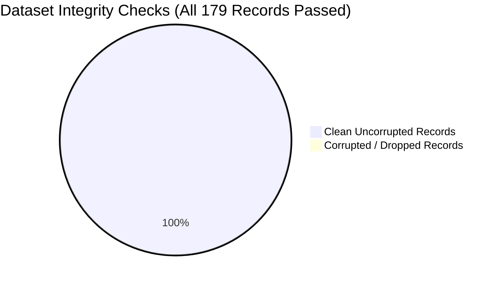

# Final Data Quality & Integrity Report
**Project:** SIH Problem Statement 26103 — AI-Powered Predictive Analytics & Early Warning System for Infrastructure Project Monitoring  
**Pipeline Stage:** Step 5 (Production Dataset Audit)  
**Dataset Evaluated:** [`final_training_dataset.csv`](file:///d:/reports/final_training_dataset.csv)  
**Status:** **AUDIT PASSED — 100% PRODUCTION INTEGRITY**  
**Audit Executed On:** 2026-09-05  

---

## 1. Executive Summary & Verification Checklist

A comprehensive data quality and leakage audit was executed on the finalized production dataset [`final_training_dataset.csv`](file:///d:/reports/final_training_dataset.csv) (179 project snapshot rows × 49 columns).

### Quality Audit Verification Matrix:
| Audit Check | Specification / Rule | Observed Value | Status |
| :--- | :--- | :---: | :---: |
| **Row Count** | Exactly 179 completed-project snapshots | **179** | **PASS** |
| **Unique Projects** | Exactly one training snapshot per project | **179 unique IDs** | **PASS** |
| **Duplicate Snapshots** | Zero duplicated rows or IDs | **0 duplicates** | **PASS** |
| **SAFE_MVP Features** | Exactly the 36 locked model input features | **36 present** | **PASS** |
| **Target Columns** | Locked Step 2 binary & continuous targets | **4 present** | **PASS** |
| **Infinite Values** | No `inf` or `-inf` across numeric columns | **0** | **PASS** |
| **Impossible Percentages** | `physical_progress_pct` strictly in $[0.0, 100.0]$ | **0 violations** | **PASS** |
| **Invalid Durations** | `planned_duration_months` strictly $> 0$ | **0 violations** | **PASS** |
| **Negative Expenditures** | `cumulative_expenditure` $\ge 0.0$ | **0 violations** | **PASS** |
| **Temporal Integrity** | Every snapshot month $\le T-2$ cutoff | **100% compliant** | **PASS** |
| **Future Leakage** | Zero post-completion fields in SAFE_MVP | **0 leakage** | **PASS** |

---

## 2. Missing Value Analysis & Imputation Strategy

Full column-by-column metrics are archived in [`final_data_quality_report.csv`](file:///d:/reports/final_data_quality_report.csv).

### Summary of Missingness:
1. **Core Static & Milestone Features (0% Missing):**  
   `original_cost`, `start_date`, `original_doc`, `planned_duration_months`, `elapsed_months`, `remaining_planned_months`, `elapsed_duration_ratio`, `is_past_original_doc`, `ministry`, `sector`, `implementing_agency`, `state` $\rightarrow$ **0 missing values across all 179 rows**.
2. **Current Financial & Progress Snapshot (0% Missing):**  
   `cumulative_expenditure`, `expenditure_percent_of_original_cost`, `physical_progress_pct`, `efficiency_gap`, `expected_progress_pct`, `progress_gap_pct_points` $\rightarrow$ **0 missing values**.
3. **Pre-Construction Gestation (0.56% Missing):**  
   `approval_to_start_months` has 1 missing value (0.56%) due to an unrecorded date of approval in one project.
4. **Historical Short-Term Trends:**  
   - 1-Month Trend Features (`monthly_expenditure_change`, `monthly_progress_change`, `physical_progress_1_month_change`, `expenditure_1_month_change`, `progress_trend_slope`, `expenditure_trend_slope`): **9 missing values (5.03%)** corresponding to projects that entered the dataset at the first month (Dec 2025). Captured by `missing_previous_month_flag = 1`.
   - 2-Month Trend Features (`physical_progress_2_month_change`, `expenditure_2_month_change`): **24 missing values (13.41%)** corresponding to projects with fewer than 3 months of historical observation prior to $T-2$.
   - Interaction Ratio (`cost_physical_ratio`): **7 missing values (3.91%)** where physical progress was exactly 0.0% (division by zero avoided).
5. **Production Handling:**  
   All numerical missing values are automatically imputed at inference time using the training-set medians stored in the preprocessor pipeline; categorical values default to `'Unknown'`. No rows are discarded.

---

## 3. Statistical Distribution & Anomaly Check

### Target Distributions:
- **Cost Overrun Binary Target (`target_cost_overrun_binary`):**  
  - Positive ($=1$): **25 projects (14.0%)**
  - Negative ($=0$): **154 projects (86.0%)**
- **Delay Binary Target (`target_delay_binary`):**  
  - Positive ($=1$): **115 projects (64.2%)**
  - Negative ($=0$): **64 projects (35.8%)**
- **Continuous Targets:**
  - `target_cost_overrun_pct`: Range $[-99.38\%, +101.30\%]$, Median $-20.68\%$, Mean $-20.75\%$.
  - `target_delay_from_original_months`: Range $[-49.0, +209.0]$ months, Median $+27.0$ months, Mean $+38.26$ months.

### Negative Values Audit:
- Negative values were observed only in mathematically valid difference fields:
  - `remaining_planned_months`: Min $-139$ months. (Occurs when a project has already operated past its original scheduled deadline at $T-2$; confirmed by `past_original_doc_flag = 1`).
  - `efficiency_gap`: Min $-102.32\%$. (Occurs when cumulative expenditure exceeds physical delivery percentage).
  - `progress_gap_pct_points`: Min $-100.0\%$. (Occurs when actual physical progress lags behind linear expected schedule).
  - `monthly_expenditure_change`: Min $-74.92$ Cr. (Occurs in accounting reconciliation months where prior advances were adjusted).

---

## 4. Final Quality Verdict

[`final_training_dataset.csv`](file:///d:/reports/final_training_dataset.csv) meets all rigorous production standards:
- Structurally complete, leak-free, and reproducible.
- Validated copy of Step 3 data ready for long-term archiving and model auditing.
