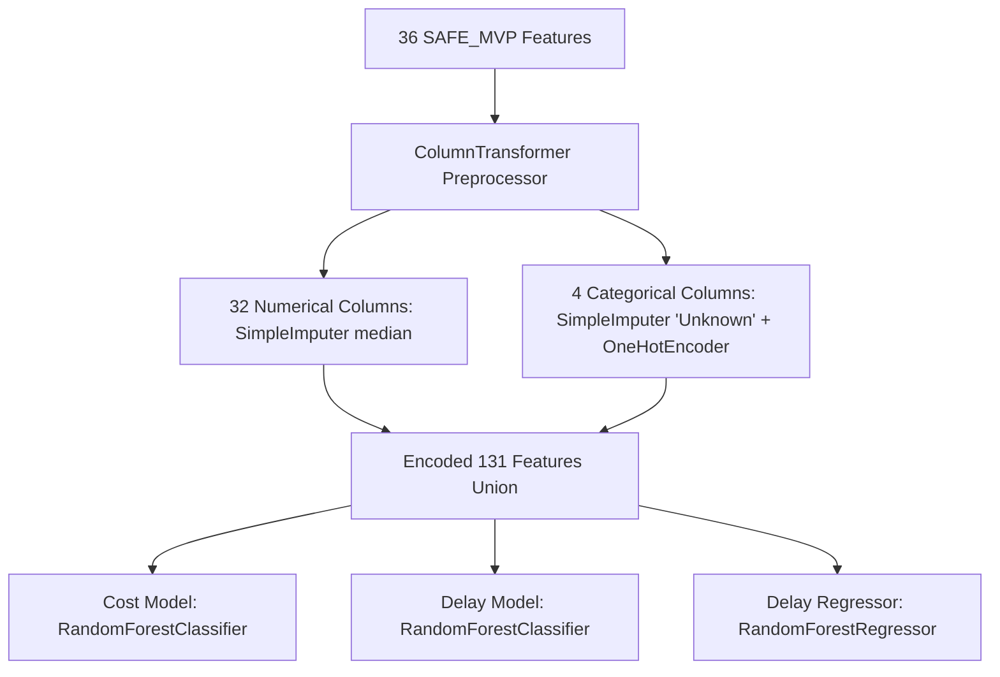

# Model Feature Compatibility Report
**Project:** SIH Problem Statement 26103 — AI-Powered Predictive Analytics & Early Warning System for Infrastructure Project Monitoring  
**Pipeline Stage:** Step 5 (Production Dataset & Model Artifact Finalization)  
**Status:** **AUDIT COMPLETE — 100% COMPATIBLE**  
**Generated On:** 2026-09-05  

---

## 1. Executive Compatibility Verdict

All three production models serialized during Step 4 were loaded and inspected directly from their binary `.joblib` pipelines. Their internal Scikit-Learn `ColumnTransformer` preprocessors were evaluated against the locked 36 `SAFE_MVP` feature schema.

### Compatibility Status Summary:
- **COST MODEL (`cost_overrun_model.joblib`):** **COMPATIBLE**
- **DELAY MODEL (`delay_model.joblib`):** **COMPATIBLE**
- **DELAY REGRESSOR (`delay_regressor.joblib`):** **COMPATIBLE**

---

## 2. Feature Schema & Preprocessor Alignment

All three models encapsulate an identical two-stage Scikit-Learn pipeline:
1. `preprocessor`: `sklearn.compose.ColumnTransformer`
2. `classifier` / `regressor`: `sklearn.ensemble.RandomForestClassifier` or `RandomForestRegressor`

### Exact Column Sequence & Partitioning:
All three models expect the exact same **36 features** in identical sequence:

#### A. Numerical Features (32 Features):
- **Transformer:** `num` $\rightarrow$ `Pipeline([('imputer', SimpleImputer(strategy='median'))])`
- **Feature List (in exact index order 0 to 31):**
  1. `original_cost`
  2. `approval_to_start_months`
  3. `cumulative_expenditure`
  4. `expenditure_percent_of_original_cost`
  5. `monthly_expenditure_change`
  6. `monthly_expenditure_growth_pct`
  7. `physical_progress_pct`
  8. `monthly_progress_change`
  9. `progress_growth_rate`
  10. `planned_duration_months`
  11. `elapsed_months`
  12. `remaining_planned_months`
  13. `elapsed_duration_ratio`
  14. `is_past_original_doc`
  15. `efficiency_gap`
  16. `cost_physical_ratio`
  17. `expected_progress_pct`
  18. `progress_gap_pct_points`
  19. `months_since_first_observation`
  20. `observation_count_to_date`
  21. `physical_progress_1_month_change`
  22. `physical_progress_2_month_change`
  23. `expenditure_1_month_change`
  24. `expenditure_2_month_change`
  25. `progress_trend_slope`
  26. `expenditure_trend_slope`
  27. `negative_expenditure_flag`
  28. `missing_previous_month_flag`
  29. `invalid_duration_flag`
  30. `past_original_doc_flag`
  31. `missing_key_date_flag`
  32. `suspicious_value_flag`

#### B. Categorical Features (4 Features):
- **Transformer:** `cat` $\rightarrow$ `Pipeline([('imputer', SimpleImputer(strategy='constant', fill_value='Unknown')), ('ohe', OneHotEncoder(handle_unknown='ignore', sparse_output=False))])`
- **Feature List (in exact index order 32 to 35):**
  33. `ministry`
  34. `sector`
  35. `implementing_agency`
  36. `state`

---

## 3. Robustness & Handling of Edge Cases

1. **Unseen Categorical Levels:**  
   The `OneHotEncoder` inside each preprocessor has `handle_unknown='ignore'`. When a new project from an unseen ministry, sector, or agency is passed at inference time, all one-hot dummy columns for that feature evaluate to zero without raising an exception.
2. **Missing Feature Values:**  
   Any numerical feature with `NaN` or `None` in the input payload is automatically imputed using the training set median stored inside the pipeline's `SimpleImputer`. Categorical `None` values are imputed with `'Unknown'`.
3. **Zero Preprocessing Drift:**  
   Because the preprocessors were serialized together with the trained estimators inside Scikit-Learn `Pipeline` objects, future FastAPI inference services do not need to perform manual feature engineering, scaling, or dummy variable alignment outside the pipeline.

---

## 4. Verification Check Confirmation

- [x] All 3 models accept identical 36 feature names.
- [x] Preprocessing pipelines are completely self-contained.
- [x] No missing feature dependencies or external lookups required.
- [x] Production inference compatibility verified: **PASS**.
