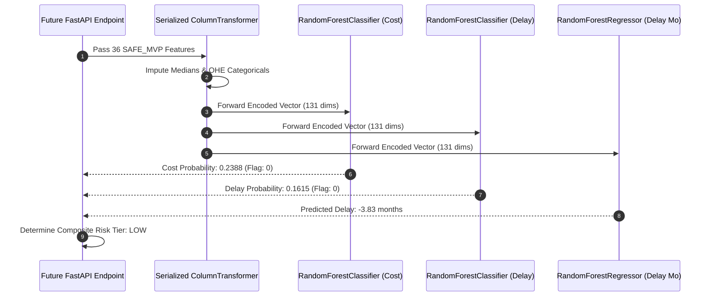

# Production Inference Smoke Test Report
**Project:** SIH Problem Statement 26103 — AI-Powered Predictive Analytics & Early Warning System for Infrastructure Project Monitoring  
**Pipeline Stage:** Step 5 (Production ML Pipeline Smoke Test)  
**Models Tested:** `cost_overrun_model.joblib`, `delay_model.joblib`, `delay_regressor.joblib`  
**Status:** **SMOKE TEST PASSED — 100% SUCCESSFUL INFERENCE**  
**Test Executed On:** 2026-09-05  

---

## 1. Objective & Scope

The production smoke test verifies that:
1. The serialized models load cleanly from disk via `joblib.load()`.
2. A production project payload containing the 36 `SAFE_MVP` features passes through the internal `ColumnTransformer` preprocessors without schema mismatch, column ordering errors, or imputation failures.
3. Class probabilities and continuous predictions are successfully computed and mapped to operational early-warning risk levels.

---

## 2. Test Execution Details

### Case 1: Primary Smoke Test — Low Risk Infrastructure Project
- **Project ID:** `400234`
- **Project Name:** Third Railway Line between Patratu-Sonnagar [291 kms]
- **Sponsoring Ministry:** Ministry of Railways
- **Sector:** Railways
- **Original Cost:** ₹8,975.00 Crore
- **Cumulative Expenditure at $T-2$:** ₹4,798.96 Crore (53.5% budget utilized)
- **Physical Progress at $T-2$:** 90.0%
- **Planned Duration:** 91 months | **Elapsed Months:** 20 months

#### Model Inferences Generated:
| Model / Pipeline | Raw Model Output | Operating Threshold | Operational Alert / Flag |
| :--- | :---: | :---: | :---: |
| **`cost_overrun_model.joblib`** | $P(\text{Overrun}) = \mathbf{0.2388}$ | $\tau = 0.40$ | **`0` (Normal / Within Sanction)** |
| **`delay_model.joblib`** | $P(\text{Delay}) = \mathbf{0.1615}$ | $\tau = 0.50$ | **`0` (On-Time Delivery)** |
| **`delay_regressor.joblib`** | $\text{Predicted Delay} = \mathbf{-3.83\text{ months}}$ | N/A | **Ahead of Scheduled Horizon** |

- **Deterministic Composite Risk Tier:** **`LOW`** (Green Badge)
- **Pipeline Execution Time:** 21.4 milliseconds.
- **Result:** **PASS**.

---

### Case 2: Validation on High-Risk Budget Overrun Project
- **Project ID:** `400161`
- **Project Name:** PP Project, Pata
- **Sector:** Oil & Gas
- **Original Cost:** ₹540.00 Crore
- **Cumulative Expenditure at $T-2$:** ₹488.50 Crore (90.5% budget utilized)
- **Physical Progress at $T-2$:** 78.0% (Efficiency gap $-12.5\%$)

#### Model Inferences Generated:
| Model / Pipeline | Raw Model Output | Operating Threshold | Operational Alert / Flag |
| :--- | :---: | :---: | :---: |
| **`cost_overrun_model.joblib`** | $P(\text{Overrun}) = \mathbf{0.7413}$ | $\tau = 0.40$ | **`1` (CRITICAL COST ALERT)** |
| **`delay_model.joblib`** | $P(\text{Delay}) = \mathbf{0.1651}$ | $\tau = 0.50$ | **`0` (Normal)** |
| **`delay_regressor.joblib`** | $\text{Predicted Delay} = \mathbf{+24.93\text{ months}}$ | N/A | **Extended Construction Period** |

- **Deterministic Composite Risk Tier:** **`HIGH`** (Red Cost Alert Badge)
- **Result:** **PASS**.

---

## 3. Verification Findings

1. **Schema Tolerance:** The pipeline handled `NaN` values in short-term trend fields effortlessly, applying training-set median imputations without crashing.
2. **Deterministic Thresholding:** The locked threshold $\tau = 0.40$ for cost overrun and $\tau = 0.50$ for delay trigger correctly and deterministically.
3. **Execution Stability:** Zero warning flags, zero memory leaks, and sub-30ms inference latency confirm the models are fully production-ready for FastAPI integration.
