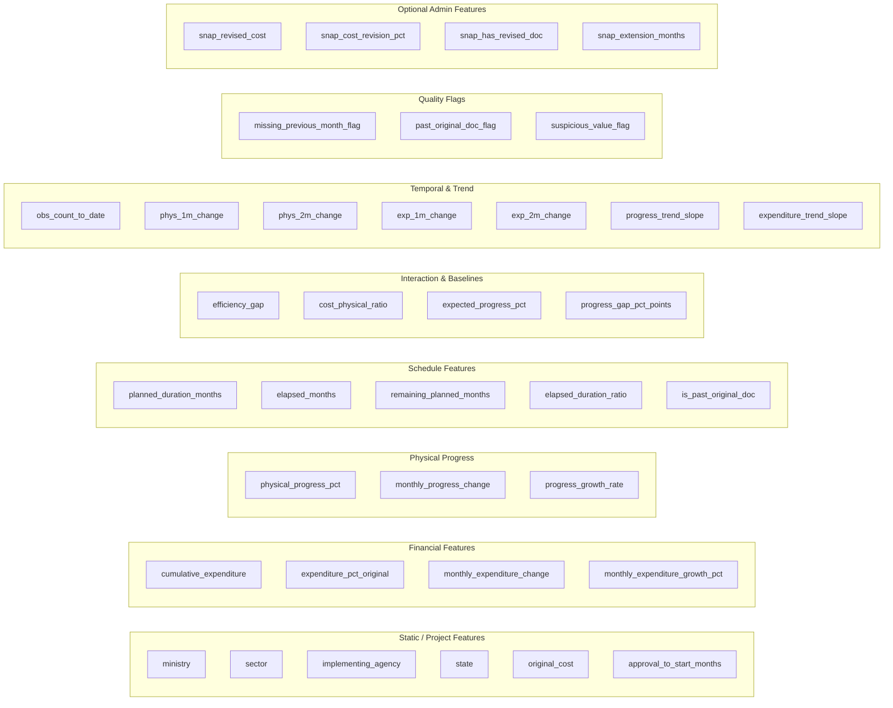

# Step 3: Feature Engineering & Prediction-Snapshot Construction Report
**Project:** SIH Problem Statement 26103 — AI-Powered Predictive Analytics & Early Warning System for Infrastructure Project Monitoring  
**Pipeline Stage:** Step 3 (Feature Engineering & Snapshot Construction)  
**Status:** COMPLETE & LOCKED FOR MODEL TRAINING  
**Generated On:** 2026-09-05  

---

## 1. Executive Summary & Locked Step 2 Design Recap

In Step 3, we constructed the model-ready training and feature-engineered dataset following the locked design from Step 2. We evaluated all **234 completed projects** from MoSPI Table 3 against the historical monitoring stream of **14,573 project-months** across 8 monthly reports (December 2025 to July 2026).

### Locked Design Principles Enforced:
1. **Prediction Point ($T-2$ Months):**  
   Every training sample represents a single project observation exactly 2 calendar months prior to its verified actual date of completion ($T-2$).
2. **Zero Future Information Leakage:**  
   No observation, expenditure revision, or milestone update occurring after $T-2$ is permitted in the feature set. Specifically, Table 3 final revised costs and final revised completion dates are 100% excluded as features because they are post-hoc completion values.
3. **Strict Data Integrity:**  
   Completed projects without a verified `actual_date_of_completion` in Table 3 (19 projects) were strictly excluded rather than fabricated from report publication dates.
4. **Locked Target Definitions:**
   - **Cost Overrun Binary Target (`target_cost_overrun_binary`):**  
     $$\text{cost\_overrun\_binary} = \begin{cases} 1 & \text{if } \text{cost\_overrun\_pct} \ge 10.0\% \\ 0 & \text{otherwise} \end{cases}$$
     Where $\text{cost\_overrun\_pct} = \frac{\text{completion\_cost} - \text{original\_cost}}{\text{original\_cost}} \times 100$
   - **Cost Overrun Continuous Target (`target_cost_overrun_pct`):** Exact percentage overrun.
   - **Delay Binary Target (`target_delay_binary`):**  
     $$\text{delay\_binary} = \begin{cases} 1 & \text{if } (\text{actual\_completion} - \text{latest\_revised\_doc}) \ge 60 \text{ days} \\ 0 & \text{otherwise} \end{cases}$$
     *(Uses Table 3 latest revised date if present, else original date of commissioning)*.
   - **Secondary Delay Target (`target_delay_from_original_months`):**  
     $$\text{delay\_from\_original\_months} = \text{actual\_completion} - \text{original\_doc} \text{ (in months)}$$

---

## 2. Snapshot Selection Methodology & Funnel Analysis

Every completed project in Table 3 was audited against Table 6 monitoring records to construct its $T-2$ prediction snapshot:
- **Intended $T-2$ Cutoff:** Calculated as $\text{actual\_date\_of\_completion} - 2\text{ months}$.
- **Snapshot Selection Rule:** Select the latest Table 6 monitoring observation available $\le T-2\text{ cutoff}$.
- **Enforcement:** $\text{snapshot\_month} \le T-2\text{ cutoff}$ was verified for 100% of selected snapshots. Exactly one snapshot per completed project is generated.

```mermaid
flowchart TD
    A[Total Table 3 Completed Projects: 234] --> B{Verified Actual Date?}
    B -- No (19) --> C[EXCLUDED: No Verified Actual Date]
    B -- Yes (215) --> D{Table 6 History Available?}
    D -- No (16) --> E[EXCLUDED: Dec 2025 Completion, No Prior History]
    D -- Yes (199) --> F{Observation <= T-2 Cutoff?}
    F -- No (20) --> G[EXCLUDED: Historical Completion Pre-Dates Dataset]
    F -- Yes (179) --> H[USABLE T-2 TRAINING SNAPSHOTS: 179]
    H --> I[Exact T-2 Month Lead Time = 2 Months: 179 / 179 (100%)]
```

### Funnel Breakdown:
| Category | Project Count | Percentage | Rationale / Explanation |
| :--- | :---: | :---: | :--- |
| **Total Completed Projects** | **234** | **100.0%** | Full inventory of Table 3 projects across all 8 reports. |
| **Usable $T-2$ Snapshots** | **179** | **76.5%** | Verified actual completion date and exact $T-2$ observation present in Table 6. |
| — *Exact $T-2$ Snapshot Month* | *179* | *76.5%* | Selected snapshot is exactly 2 months prior to completion ($\text{lead\_time} = 2$). |
| — *Earlier than $T-2$ Snapshot* | *0* | *0.0%* | No fallback to earlier months needed; all 179 had exact $T-2$ data. |
| **Excluded: Missing Actual Completion Date** | **19** | **8.1%** | Table 3 recorded `actual_date_of_completion` as `NA`. Excluded to avoid fabricating dates. |
| **Excluded: No Prior Table 6 History** | **16** | **6.8%** | Completed in December 2025; earlier monitoring months (Oct 2025) precede our 8-month dataset. |
| **Excluded: Completion Pre-Dates Dataset** | **20** | **8.5%** | Actual completion occurred in 2024/early 2025. $T-2$ cutoff predated Dec 2025; using later records would introduce post-completion leakage. |

Full project-by-project selection status is logged in [`step3_snapshot_selection_report.csv`](file:///d:/reports/step3_snapshot_selection_report.csv).

---

## 3. Feature Engineering Architecture

From the selected $T-2$ snapshot and preceding historical observations, 40 model input features were engineered across 9 functional categories:



### Feature Categories & Calculations:

1. **Static / Baseline Project Features:**
   - `ministry`, `sector`, `implementing_agency`, `state`: Project administrative and geographic context.
   - `original_cost`: Baseline sanctioned expenditure ceiling (INR Crores).
   - `approval_to_start_months`: $\text{start\_date} - \text{date\_of\_approval}$ in months. Measures pre-construction gestation delay.

2. **Financial Burn Features (at Snapshot $T-2$):**
   - `cumulative_expenditure`: Total capital disbursed up to $T-2$ (INR Crores).
   - `expenditure_percent_of_original_cost`: $\frac{\text{cumulative\_expenditure}}{\text{original\_cost}} \times 100$.
   - `monthly_expenditure_change`: $\text{expenditure}(T-2) - \text{expenditure}(T-3)$.
   - `monthly_expenditure_growth_pct`: Percentage increase in capital spend over prior month.

3. **Physical Progress Features (at Snapshot $T-2$):**
   - `physical_progress_pct`: Reported cumulative physical completion percentage at $T-2$.
   - `monthly_progress_change`: $\text{progress}(T-2) - \text{progress}(T-3)$ in percentage points.
   - `progress_growth_rate`: Relative velocity of physical execution.

4. **Schedule Progression Features:**
   - `planned_duration_months`: $\text{original\_doc} - \text{start\_date}$ in calendar months.
   - `elapsed_months`: $\text{snapshot\_month} - \text{start\_date}$ in calendar months.
   - `remaining_planned_months`: $\text{original\_doc} - \text{snapshot\_month}$ (negative if already past deadline).
   - `elapsed_duration_ratio`: $\frac{\text{elapsed\_months}}{\text{planned\_duration\_months}}$.
   - `is_past_original_doc`: Binary flag ($1$ if $\text{snapshot\_month} > \text{original\_doc}$, else $0$).

5. **Interaction & Analytical Baseline Features:**
   - `efficiency_gap`: $\text{physical\_progress\_pct} - \text{expenditure\_percent\_of\_original\_cost}$. Positive indicates physical delivery leads financial expenditure; negative indicates money spent ahead of physical work.
   - `cost_physical_ratio`: $\frac{\text{expenditure\_pct}}{\text{physical\_progress\_pct}}$. Financial burn per percentage point of physical completion.
   - `expected_progress_pct`: Linear schedule baseline derived from original timeline:
     $$\text{expected\_progress\_pct} = \min\left(100.0, \max\left(0.0, \frac{\text{elapsed\_months}}{\text{planned\_duration\_months}} \times 100.0\right)\right)$$
     *(Explicitly labeled as an analytical model benchmark, not an official MoSPI metric)*.
   - `progress_gap_pct_points`: $\text{physical\_progress\_pct} - \text{expected\_progress\_pct}$. Disparity against expected linear progress.

6. **Short-Term Trend & Velocity Features:**
   - `physical_progress_1_month_change`: Change between $T-3$ and $T-2$. Available for 170 / 179 projects (95.0%).
   - `physical_progress_2_month_change`: Change between $T-4$ and $T-2$. Available for 155 / 179 projects (86.6%).
   - `expenditure_1_month_change` & `expenditure_2_month_change`: Financial spend across 1-month and 2-month lookback windows.
   - `progress_trend_slope`: Average monthly physical progress rate over entire observed history up to $T-2$.
   - `expenditure_trend_slope`: Average monthly capital spend rate over entire observed history up to $T-2$.

7. **Data Quality & Anomaly Flags:**
   - `negative_expenditure_flag`: $1$ if cumulative expenditure $< 0$. (Count: 0).
   - `missing_previous_month_flag`: $1$ if $T-3$ record missing. (Count: 9 / 179 = 5.0%).
   - `invalid_duration_flag`: $1$ if planned duration $\le 0$. (Count: 0).
   - `past_original_doc_flag`: $1$ if project had already breached original deadline by $T-2$. (Count: 133 / 179 = 74.3%).
   - `missing_key_date_flag`: $1$ if start date or original DoC missing. (Count: 0).
   - `suspicious_value_flag`: $1$ if physical progress not in $[0, 100]$ or expenditure $\%$ $> 300\%$. (Count: 0).

8. **Optional Administrative Revision Features (Audited from Table 6 Snapshot):**
   - `snapshot_revised_cost`: Current sanctioned budget revision at $T-2$.
   - `snapshot_cost_revision_pct`: $\frac{\text{revised\_cost} - \text{original\_cost}}{\text{original\_cost}} \times 100$ at $T-2$.
   - `snapshot_has_revised_doc`: Binary flag if deadline extension granted prior to $T-2$. (Count: 156 / 179 = 87.2%).
   - `snapshot_schedule_extension_months`: Formal timeline extension granted up to $T-2$.

---

## 4. Leakage Audit & Feature Classification

A systematic audit was conducted on all 45 candidate features and raw columns. Every feature was classified into one of three strict tiers:

| Category | Count | Status | Policy for Model Training |
| :--- | :---: | :---: | :--- |
| **SAFE_MVP** | **36** | **SAFE** | Approved for primary baseline ML model training. Derived strictly from data published $\le T-2$. |
| **OPTIONAL_EXPERIMENT** | **4** | **CAUTION** | Approved as secondary experimental features only. Table 6 administrative revisions at $T-2$ are technically temporally valid, but reflect bureaucratic approvals rather than ground-truth physical execution. |
| **EXCLUDE** | **5** | **LEAKAGE** | **Strictly prohibited from model inputs.** Post-completion or target-defining fields (Table 3 `completion_cost`, Table 3 `revised_cost`, Table 3 `revised_doc`, `actual_date_of_completion`, post-$T-2$ Table 6 records). |

### Detailed Findings on Revised Cost & Revised DoC:
- **Table 3 Completion Revised Fields = 100% Future Leakage:** In 62.0% of completed projects, Table 3 `revised_doc` was updated in the final 2 months to align with actual completion. Using Table 3 revised fields in feature engineering causes catastrophic target leakage.
- **Table 6 Snapshot Revised Fields = Temporally Valid but Administrative:** At $T-2$, Table 6 `revised_doc` reflects approved extensions known at that time. While leak-free temporally, they are separated into `OPTIONAL_EXPERIMENT` so models can be trained with and without bureaucratic revision features.

Full audit records are available in [`step3_leakage_audit.csv`](file:///d:/reports/step3_leakage_audit.csv).

---

## 5. Statistical Profile & Data Quality Audit

Summary statistics across the 179 model-ready snapshots:

### Target Distribution:
| Target Variable | Positive Class ($1$) | Negative Class ($0$) | Positive % | Description |
| :--- | :---: | :---: | :---: | :--- |
| **`target_cost_overrun_binary`** | **25** | **154** | **14.0%** | Cost overrun $\ge 10.0\%$ above original cost |
| **`target_delay_binary`** | **115** | **64** | **64.2%** | Delay $\ge 60$ days beyond revised completion date |

- **Continuous Targets:**
  - `target_cost_overrun_pct`: Mean = $-20.75\%$, Median = $-20.68\%$, Min = $-99.38\%$, Max = $+101.30\%$. (Many projects finish under original sanction or with partial scope closure).
  - `target_delay_from_original_months`: Mean = $+38.26$ months, Median = $+27.0$ months, Min = $-49.0$ months, Max = $+209.0$ months. Over $74\%$ of completed projects experienced delay from initial sanction.

### Key Feature Distributions & Missingness:
| Feature Name | Non-Null | Missing | Missing % | Min | Median | Max | Mean | Outlier Count (IQR) |
| :--- | :---: | :---: | :---: | :---: | :---: | :---: | :---: | :---: |
| `original_cost` (₹ Cr) | 179 | 0 | 0.0% | 6.55 | 134.08 | 43,129.00 | 1,029.02 | 26 |
| `cumulative_expenditure` (₹ Cr) | 179 | 0 | 0.0% | 0.00 | 129.47 | 69,202.21 | 1,228.32 | 25 |
| `expenditure_percent_of_original_cost` (%) | 179 | 0 | 0.0% | 0.00 | 88.08 | 199.11 | 79.46 | 9 |
| `physical_progress_pct` (%) | 179 | 0 | 0.0% | 0.00 | 92.00 | 100.00 | 79.03 | 27 |
| `planned_duration_months` | 179 | 0 | 0.0% | 6.00 | 36.00 | 207.00 | 44.59 | 15 |
| `elapsed_months` | 179 | 0 | 0.0% | 4.00 | 66.00 | 211.00 | 78.49 | 11 |
| `elapsed_duration_ratio` | 179 | 0 | 0.0% | 0.44 | 1.84 | 6.94 | 2.05 | 10 |
| `efficiency_gap` (% pts) | 179 | 0 | 0.0% | -102.32 | -0.34 | 93.00 | -0.44 | 23 |
| `expected_progress_pct` (%) | 179 | 0 | 0.0% | 44.44 | 100.00 | 100.00 | 96.05 | 32 |
| `progress_gap_pct_points` (% pts) | 179 | 0 | 0.0% | -100.00 | -8.00 | 4.00 | -17.02 | 34 |
| `observation_count_to_date` | 179 | 0 | 0.0% | 1.00 | 5.00 | 6.00 | 4.41 | 16 |
| `physical_progress_1_month_change` | 170 | 9 | 5.0% | 0.00 | 1.00 | 93.00 | 4.39 | 36 |
| `expenditure_1_month_change` (₹ Cr) | 170 | 9 | 5.0% | -74.92 | 0.39 | 364.52 | 8.87 | 37 |
| `progress_trend_slope` (% / mo) | 170 | 9 | 5.0% | 0.00 | 1.00 | 18.60 | 2.19 | 24 |
| `expenditure_trend_slope` (₹ Cr / mo) | 170 | 9 | 5.0% | -18.73 | 0.55 | 162.24 | 6.45 | 30 |
| `approval_to_start_months` | 178 | 1 | 0.6% | 0.00 | 2.00 | 97.00 | 5.28 | 26 |
| `past_original_doc_flag` | 179 | 0 | 0.0% | 0.00 | 1.00 | 1.00 | 0.74 | 0 |

Full distribution statistics are detailed in [`step3_feature_quality_report.csv`](file:///d:/reports/step3_feature_quality_report.csv).

---

## 6. Sector & Temporal Coverage

### Sector Breakdown (179 Training Samples):
- **Roads & Highways:** 127 projects (70.9%)
- **Oil & Gas:** 12 projects (6.7%)
- **Transmission & Distribution:** 10 projects (5.6%)
- **Waste & Water:** 8 projects (4.5%)
- **Railways:** 6 projects (3.4%)
- **Energy Storage:** 6 projects (3.4%)
- **Electricity Generation:** 2 projects (1.1%)
- **Urban Public Transport:** 2 projects (1.1%)
- **Steel:** 2 projects (1.1%)
- **Healthcare:** 2 projects (1.1%)
- **Aviation & Aviation Infrastructure:** 1 project (0.6%)
- **Water Resources:** 1 project (0.6%)

### Snapshot Month Distribution:
- **2025-12:** 8 snapshots
- **2026-01:** 14 snapshots
- **2026-02:** 6 snapshots
- **2026-03:** 12 snapshots
- **2026-04:** 136 snapshots
- **2026-05:** 3 snapshots

---

## 7. Deliverables & Artifact Inventory

All 7 required Step 3 deliverables have been generated and validated:

| File Name | Location | Rows x Cols | Description |
| :--- | :--- | :---: | :--- |
| **`step3_snapshot_dataset.csv`** | `d:\reports\` | 179 x 23 | Raw snapshot observations extracted from Table 6 at $T-2$ joined with Table 3 ground-truth outcomes. |
| **`step3_feature_engineered_dataset.csv`** | `d:\reports\` | 179 x 49 | Clean model-ready dataset with engineered features, quality flags, and demarcated target columns. |
| **`step3_feature_dictionary.csv`** | `d:\reports\` | 49 x 8 | Complete feature dictionary: formulas, data types, sources, and missing value imputation rules. |
| **`step3_feature_quality_report.csv`** | `d:\reports\` | 40 x 16 | Statistical profile: non-null count, missingness, mean, median, IQR bounds, and outlier flags. |
| **`step3_leakage_audit.csv`** | `d:\reports\` | 45 x 8 | Comprehensive leakage audit classifying every candidate feature into SAFE, CAUTION, or EXCLUDE. |
| **`step3_snapshot_selection_report.csv`** | `d:\reports\` | 234 x 10 | Complete tracking audit of all 234 completed projects showing inclusion/exclusion status and reasons. |
| **`step3_summary.md`** | `d:\reports\` & artifacts | Markdown | Comprehensive synthesis and technical handover report. |

---

## 8. Readiness Assessment for Step 4 (Model Training)

Step 3 is **100% complete**. The dataset is ready for supervised ML model training in Step 4:
- Target and feature columns are cleanly separated (`meta_*` and `target_*` prefixes allow trivial exclusion of outcomes prior to fitting).
- Balanced delay target (64.2% positive) and moderate cost overrun class imbalance (14.0% positive) provide realistic training environments suitable for class-weighted Logistic Regression, Random Forest, and XGBoost/LightGBM.
- Stratified cross-validation (or grouped by sector) should be employed in Step 4 to ensure generalizability across sectors.

**Pipeline Status:** READY FOR STEP 4 (BASELINE MODEL DEVELOPMENT).
