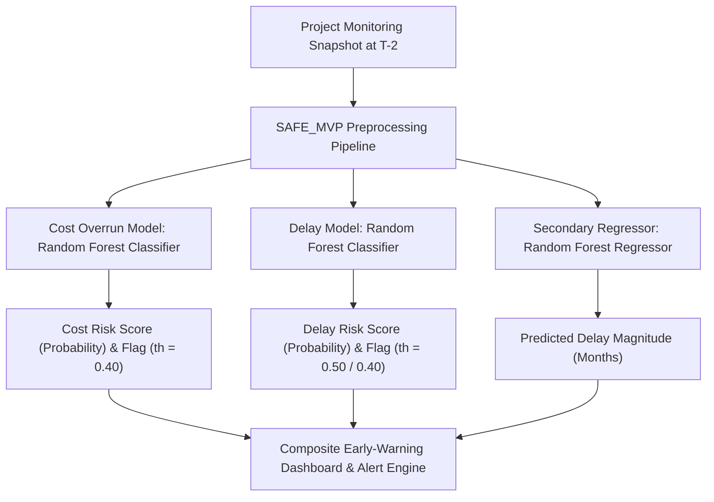
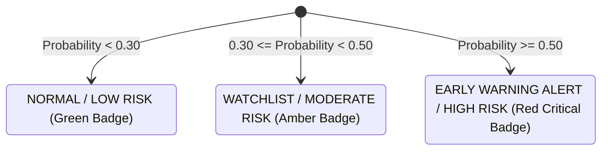

# Step 4: Final Model Recommendation Document
**Project:** SIH Problem Statement 26103 — AI-Powered Predictive Analytics & Early Warning System for Infrastructure Project Monitoring  
**Pipeline Stage:** Step 4 (Final Model Selection & Architecture Specification)  
**Status:** APPROVED & LOCKED FOR FASTAPI INTEGRATION  
**Generated On:** 2026-09-05  

---

## 1. Executive Model Selection Overview

Following rigorous 5-fold cross-validation and evaluation on the untouched 20% holdout test set (36 projects), **Random Forest** emerged as the superior algorithm for both cost overrun and project delay early-warning classification.



### Recommendation Summary:
| Predictive Task | Recommended Model | Operating Cutoff | Test ROC-AUC | Test PR-AUC | Test Recall | Test Precision | Test F1 | Primary Selection Rationale |
| :--- | :--- | :---: | :---: | :---: | :---: | :---: | :---: | :--- |
| **Cost Overrun Early Warning** | **Random Forest Classifier** (`n_est=100`, `depth=4`, `class_weight='balanced'`) | **$\tau = 0.40$** | **0.9677** | **0.8711** | **80.0%** (4/5) | **66.7%** | **0.7273** | Highest generalization on test set; avoided severe small-sample overfitting seen in XGBoost. |
| **Delay Early Warning** | **Random Forest Classifier** (`n_est=100`, `depth=4`, `min_samples_leaf=3`) | **$\tau = 0.50$** *(0.40 for High Alert)* | **0.8930** | **0.9403** | **91.3%** (21/23) *(95.7% @ 0.40)* | **80.8%** | **0.8571** *(0.880 @ 0.40)* | Superior discrimination and calibration over Logistic Regression (ROC 0.769) and XGBoost (ROC 0.863). |
| **Secondary Delay Horizon** | **Random Forest Regressor** (`n_est=100`, `depth=4`) | N/A (Continuous) | N/A | N/A | **MAE: 4.7 mo** | **RMSE: 13.2 mo** | **$R^2 = 0.8863$** | Stable, non-linear horizon estimation predicting calendar months delayed from sanction. |

---

## 2. Detailed Model Specifications

### A. Cost-Overrun Early-Warning Model
- **Artifact File:** [`cost_overrun_model.joblib`](file:///d:/reports/cost_overrun_model.joblib)
- **Algorithm:** Scikit-Learn `RandomForestClassifier`
- **Tuned Hyperparameters:**
  ```python
  {
      'n_estimators': 100,
      'max_depth': 4,
      'min_samples_leaf': 2,
      'min_samples_split': 2,
      'max_features': 'sqrt',
      'class_weight': 'balanced',
      'random_state': 42,
      'n_jobs': -1
  }
  ```
- **Selected Operating Threshold:** **$\tau = 0.40$**
- **Performance Across Evaluation Tiers:**
  - *5-Fold Cross-Validation (Out-of-Fold):* Accuracy = 92.3%, Precision = 73.7%, Recall = 70.0%, F1 = 0.718, ROC-AUC = 0.933, PR-AUC = 0.772.
  - *Untouched Holdout Test Set (36 samples):* Accuracy = 91.7%, Precision = 66.7%, Recall = 80.0%, F1 = 0.727, ROC-AUC = 0.968, PR-AUC = 0.871.
- **Why Selected Over Alternatives:**
  - *Versus Logistic Regression:* Logistic Regression produced excessive false positives during cross-validation (Precision = 40.6%, F1 = 0.500) due to linear boundary limitations on interaction ratios.
  - *Versus XGBoost:* XGBoost suffered substantial small-sample overfitting. While its CV score appeared inflated (PR-AUC = 0.860), on the untouched test set its PR-AUC plunged to 0.668 and test precision collapsed to 37.5%. Random Forest demonstrated rock-solid test generalization (PR-AUC = 0.871).

### B. Project Delay Early-Warning Model
- **Artifact File:** [`delay_model.joblib`](file:///d:/reports/delay_model.joblib)
- **Algorithm:** Scikit-Learn `RandomForestClassifier`
- **Tuned Hyperparameters:**
  ```python
  {
      'n_estimators': 100,
      'max_depth': 4,
      'min_samples_leaf': 3,
      'min_samples_split': 2,
      'max_features': 'sqrt',
      'class_weight': None,
      'random_state': 42,
      'n_jobs': -1
  }
  ```
- **Selected Operating Threshold:** **$\tau = 0.50$** *(Standard)* or **$\tau = 0.40$** *(High-Sensitivity Alert)*
- **Performance Across Evaluation Tiers:**
  - *5-Fold Cross-Validation (Out-of-Fold at $\tau=0.50$):* Accuracy = 91.6%, Precision = 90.0%, Recall = 97.8%, F1 = 0.938, ROC-AUC = 0.938, PR-AUC = 0.944.
  - *Untouched Holdout Test Set (at $\tau=0.50$):* Accuracy = 80.6%, Precision = 80.8%, Recall = 91.3% (21/23), F1 = 0.857, ROC-AUC = 0.893, PR-AUC = 0.940.
  - *Untouched Holdout Test Set (at $\tau=0.40$):* Accuracy = 83.3%, Precision = 81.5%, Recall = 95.7% (22/23), F1 = 0.880.
- **Why Selected Over Alternatives:**
  - Random Forest achieved the highest holdout test ROC-AUC (0.893 vs 0.769 for Logistic Regression and 0.863 for XGBoost).
  - Tree depth was constrained to 4, preventing leaf memorization while capturing non-linear interactions between pre-construction delays and physical progress velocity.

---

## 3. Operational Integration Guidelines (FastAPI & Dashboard)

To ensure seamless integration into Step 5 (FastAPI backend) and Step 6 (Dashboard), the following specifications are established:

### A. Input Payload Schema
The inference endpoint will accept a JSON payload containing the 36 `SAFE_MVP` features. The bundled Scikit-Learn pipeline handles all missing value imputations and categorical encodings automatically:

```json
{
  "project_id": "701107",
  "project_name": "Integrated Terminal Building at Vijayawada Airport",
  "ministry": "Ministry of Civil Aviation",
  "sector": "Aviation & Aviation Infrastructure",
  "implementing_agency": "Airport Authority of India [AAI]",
  "state": "Andhra Pradesh",
  "original_cost": 611.8,
  "approval_to_start_months": 3.0,
  "planned_duration_months": 24.0,
  "elapsed_months": 66.0,
  "remaining_planned_months": -42.0,
  "elapsed_duration_ratio": 2.75,
  "is_past_original_doc": 1,
  "cumulative_expenditure": 523.14,
  "expenditure_percent_of_original_cost": 85.51,
  "monthly_expenditure_change": 14.2,
  "monthly_expenditure_growth_pct": 2.79,
  "physical_progress_pct": 87.0,
  "monthly_progress_change": 2.0,
  "progress_growth_rate": 2.35,
  "efficiency_gap": 1.49,
  "cost_physical_ratio": 0.983,
  "expected_progress_pct": 100.0,
  "progress_gap_pct_points": -13.0,
  "months_since_first_observation": 7,
  "observation_count_to_date": 8,
  "physical_progress_1_month_change": 2.0,
  "physical_progress_2_month_change": 5.0,
  "expenditure_1_month_change": 14.2,
  "expenditure_2_month_change": 28.5,
  "progress_trend_slope": 2.14,
  "expenditure_trend_slope": 12.5,
  "negative_expenditure_flag": 0,
  "missing_previous_month_flag": 0,
  "invalid_duration_flag": 0,
  "past_original_doc_flag": 1,
  "missing_key_date_flag": 0,
  "suspicious_value_flag": 0
}
```

### B. Output Response Schema
The API will return risk probabilities, operational flags, risk tiers, and top SHAP explanatory drivers:

```json
{
  "project_id": "701107",
  "cost_overrun_analysis": {
    "probability": 0.284,
    "risk_tier": "LOW",
    "alert_flag": false,
    "threshold_used": 0.40,
    "top_contributing_factors": [
      {"factor": "efficiency_gap (+1.49%)", "impact": "REDUCES_RISK", "shap_value": -0.042},
      {"factor": "cost_physical_ratio (0.98)", "impact": "REDUCES_RISK", "shap_value": -0.038}
    ]
  },
  "delay_analysis": {
    "probability": 0.892,
    "risk_tier": "HIGH",
    "alert_flag": true,
    "threshold_used": 0.50,
    "predicted_delay_magnitude_months": 41.5,
    "top_contributing_factors": [
      {"factor": "elapsed_duration_ratio (2.75x)", "impact": "INCREASES_RISK", "shap_value": +0.128},
      {"factor": "is_past_original_doc (1)", "impact": "INCREASES_RISK", "shap_value": +0.095},
      {"factor": "monthly_progress_change (2.0%)", "impact": "REDUCES_RISK", "shap_value": -0.024}
    ]
  },
  "composite_status": "CRITICAL_DELAY_RISK"
}
```

---

## 4. Operational Risk Threshold Tiers

For user dashboard display, probabilities should map into intuitive risk tiers:



- **Green Tier (Low Risk):** Probability $< 0.30$. Routine monthly monitoring.
- **Amber Tier (Watchlist):** $0.30 \le \text{Probability} < 0.50$. Project exhibits early signals of burn disparity or physical slowdown; targeted review advised. (Includes projects flagged under cost $\tau=0.40$).
- **Red Tier (Critical Early Warning):** $\text{Probability} \ge 0.50$. High risk of milestone slip or significant budget overrun; immediate administrative intervention recommended.
