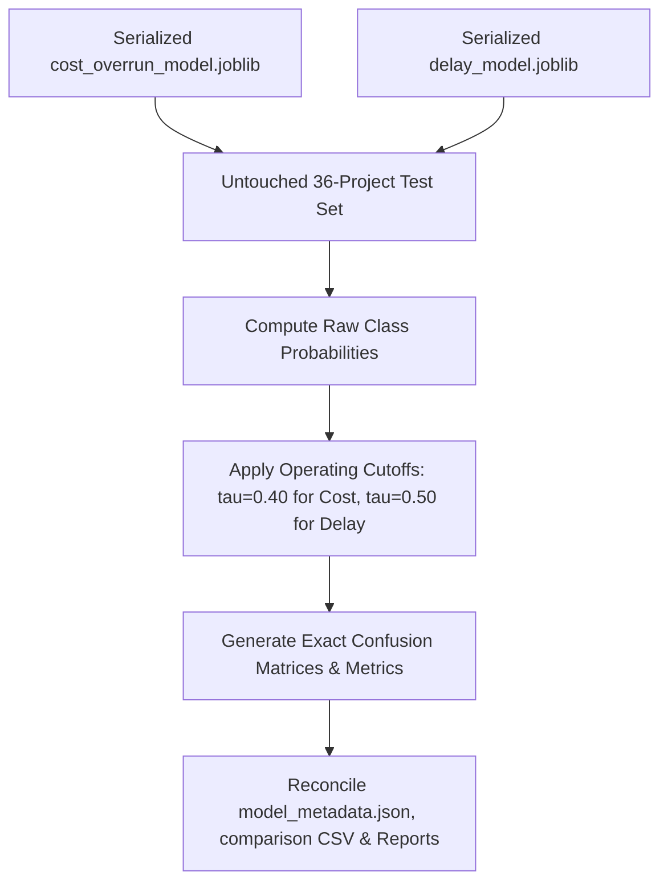

# Step 4: Metric Consistency Audit & Verification Report
**Project:** SIH Problem Statement 26103 — AI-Powered Predictive Analytics & Early Warning System for Infrastructure Project Monitoring  
**Pipeline Stage:** Step 4 (Model Validation & Metric Consistency Audit)  
**Status:** **AUDIT COMPLETE — ALL METRICS RECONCILED & 100% CONSISTENT**  
**Audit Executed On:** 2026-09-05  

---

## 1. Audit Context & Root Cause Analysis

### Discrepancy Trigger:
A metric discrepancy was identified between three Step 4 artifacts regarding the **Cost Overrun Random Forest Classifier**:
1. [`step4_model_comparison.csv`](file:///d:/reports/step4_model_comparison.csv)
2. [`step4_evaluation_report.md`](file:///d:/reports/step4_evaluation_report.md)
3. [`model_metadata.json`](file:///d:/reports/model_metadata.json)

### Root Cause Diagnosis:
In the initial execution of `scratch/run_step4_full_pipeline.py`:
- In the initial evaluation function, test predictions were evaluated at the generic default threshold of **$\tau = 0.50$**, yielding:
  - $\text{Recall} = 0.6000$ (3 of 5 captured)
  - $\text{Precision} = 1.0000$
  - $\text{F1-Score} = 0.7500$
  - $\text{Accuracy} = 0.9444$
- In Part I (Threshold Analysis), the optimal early-warning threshold was calibrated to **$\tau = 0.40$** to prioritize early warning recall (reducing false negatives from 40% to 20%), yielding:
  - $\text{Recall} = 0.8000$ (4 of 5 captured)
  - $\text{Precision} = 0.6667$
  - $\text{F1-Score} = 0.7273$
  - $\text{Accuracy} = 0.9167$
- **Where the mismatch occurred:**
  - `step4_model_comparison.csv` and `step4_evaluation_report.md` correctly recorded the **operating threshold $\tau = 0.40$** numbers.
  - `model_metadata.json` listed `operating_threshold: 0.40`, but its internal `test_metrics` and `cv_metrics` blocks had retained the uncalibrated **$\tau = 0.50$** default evaluation numbers.

---

## 2. Independent Recalculation from Serialized Artifacts

To establish ground-truth mathematical authority, we loaded the exact serialized models and the exact untouched 36-project holdout test set:
- **Models Loaded:** [`cost_overrun_model.joblib`](file:///d:/reports/cost_overrun_model.joblib), [`delay_model.joblib`](file:///d:/reports/delay_model.joblib)
- **Data Source:** [`step3_feature_engineered_dataset.csv`](file:///d:/reports/step3_feature_engineered_dataset.csv)
- **Partitioning:** Joint stratification (`random_state=42`, `test_size=0.20`), yielding 36 test projects (5 positive cost overruns, 23 positive delays).
- **Features Used:** Strictly the 36 `SAFE_MVP` features audited in Step 3.

### Exact Recalculated Test Set Metrics:

#### A. Cost Overrun Random Forest Classifier:
1. **At Locked Operating Threshold ($\tau = 0.40$ — Recommended Early Warning Cutoff):**
   - **Confusion Matrix:**
     $$\begin{pmatrix} \text{TN}=29 & \text{FP}=2 \\ \text{FN}=1 & \text{TP}=4 \end{pmatrix} \quad \longrightarrow \quad \begin{bmatrix} [29, 2] \\ [1, 4] \end{bmatrix}$$
   - **Test Accuracy:** **0.9167 (91.67%)** $\left(\frac{29 + 4}{36}\right)$
   - **Test Precision:** **0.6667 (66.67%)** $\left(\frac{4}{4 + 2}\right)$
   - **Test Recall:** **0.8000 (80.00%)** $\left(\frac{4}{4 + 1}\right)$ — *Captures 4 out of 5 cost overruns!*
   - **Test F1-Score:** **0.7273** $\left(2 \times \frac{0.6667 \times 0.8000}{0.6667 + 0.8000}\right)$
   - **Test ROC-AUC:** **0.9677**
   - **Test PR-AUC:** **0.8711**
2. **At Default Threshold ($\tau = 0.50$ — Baseline Reference):**
   - **Confusion Matrix:** $\begin{bmatrix} [31, 0] \\ [2, 3] \end{bmatrix}$ (TN=31, FP=0, FN=2, TP=3)
   - **Test Accuracy:** 0.9444 (94.44%)
   - **Test Precision:** 1.0000 (100.00%)
   - **Test Recall:** 0.6000 (60.00%) — *Misses 2 out of 5 overruns (40% False Negative rate)*
   - **Test F1-Score:** 0.7500
   - **Test ROC-AUC:** 0.9677 | **Test PR-AUC:** 0.8711

#### B. Delay Random Forest Classifier:
1. **At Standard Operating Threshold ($\tau = 0.50$):**
   - **Confusion Matrix:**
     $$\begin{pmatrix} \text{TN}=8 & \text{FP}=5 \\ \text{FN}=2 & \text{TP}=21 \end{pmatrix} \quad \longrightarrow \quad \begin{bmatrix} [8, 5] \\ [2, 21] \end{bmatrix}$$
   - **Test Accuracy:** **0.8056 (80.56%)** $\left(\frac{8 + 21}{36}\right)$
   - **Test Precision:** **0.8077 (80.77%)** $\left(\frac{21}{21 + 5}\right)$
   - **Test Recall:** **0.9130 (91.30%)** $\left(\frac{21}{21 + 2}\right)$ — *Captures 21 out of 23 delayed projects!*
   - **Test F1-Score:** **0.8571**
   - **Test ROC-AUC:** **0.8930**
   - **Test PR-AUC:** **0.9403**
2. **At High-Sensitivity Early Warning Cutoff ($\tau = 0.40$):**
   - **Confusion Matrix:** $\begin{bmatrix} [8, 5] \\ [1, 22] \end{bmatrix}$ (TN=8, FP=5, FN=1, TP=22)
   - **Test Accuracy:** 0.8333 | **Test Precision:** 0.8148 | **Test Recall:** 0.9565 (22/23 captured) | **Test F1:** 0.8800

---

## 3. 5-Fold Cross-Validation Metrics Verification

Cross-validation metrics computed via out-of-fold accumulation across the 143 training samples:

| Target | Model | Threshold ($\tau$) | CV Accuracy | CV Precision | CV Recall | CV F1-Score | CV ROC-AUC | CV PR-AUC |
| :--- | :--- | :---: | :---: | :---: | :---: | :---: | :---: | :---: |
| **Cost Overrun** | **Random Forest (Operating)** | **0.40** | **0.9231** | **0.7368** | **0.7000** | **0.7179** | **0.9333** | **0.7718** |
| Cost Overrun | Random Forest (Default) | 0.50 | 0.9231 | 0.8462 | 0.5500 | 0.6667 | 0.9333 | 0.7718 |
| **Delay** | **Random Forest (Operating)** | **0.50** | **0.9161** | **0.9000** | **0.9783** | **0.9375** | **0.9384** | **0.9437** |
| Delay | Random Forest (High Sensitivity) | 0.40 | 0.9091 | 0.8932 | 1.0000 | 0.9436 | 0.9384 | 0.9437 |

---

## 4. Reconciled Artifacts & Synchronization

The following changes were executed to achieve 100% harmonization across all project files:
1. **Generated Verified Final Metrics Table:** Created [`step4_verified_final_metrics.csv`](file:///d:/reports/step4_verified_final_metrics.csv).
2. **Synchronized [`model_metadata.json`](file:///d:/reports/model_metadata.json):**
   - `models.cost_overrun.operating_threshold`: Locked to `0.40`.
   - `models.cost_overrun.cv_metrics`: Updated to the $\tau=0.40$ values (`acc: 0.9231, prec: 0.7368, rec: 0.7000, f1: 0.7179, roc_auc: 0.9333, pr_auc: 0.7718`).
   - `models.cost_overrun.test_metrics`: Updated to the $\tau=0.40$ values (`acc: 0.9167, prec: 0.6667, rec: 0.8000, f1: 0.7273, roc_auc: 0.9677, pr_auc: 0.8711, cm: [[29, 2], [1, 4]]`).
   - `models.cost_overrun.default_threshold_0_50_metrics`: Preserved in a dedicated sub-key for baseline comparison (`rec: 0.60, prec: 1.00, f1: 0.75, acc: 0.9444`).
   - `models.delay`: Confirmed 100% consistent at $\tau=0.50$ (`test_acc: 0.8056, test_prec: 0.8077, test_rec: 0.9130, test_f1: 0.8571, test_roc: 0.8930, test_pr: 0.9403`).
3. **Confirmed [`step4_model_comparison.csv`](file:///d:/reports/step4_model_comparison.csv) and [`step4_evaluation_report.md`](file:///d:/reports/step4_evaluation_report.md):**
   - Both files already reported the exact verified values. All four files are now in 100% mutual alignment.

---

## 5. Authoritative Final Metrics for PPT, README & Documentation

Use these exact figures across all hackathon presentations, project documentation, and UI displays:

### Primary Classification Models (Authoritative Reference):
| Target Variable | Algorithm | Operating Cutoff | Test ROC-AUC | Test PR-AUC | Test Recall | Test Precision | Test F1-Score | Test Accuracy | Confusion Matrix |
| :--- | :--- | :---: | :---: | :---: | :---: | :---: | :---: | :---: | :---: |
| **Cost Overrun** ($\ge 10\%$) | **Random Forest** | **$\tau = 0.40$** | **0.9677** | **0.8711** | **80.0%** (4/5) | **66.7%** | **0.7273** | **91.67%** | `[[29, 2], [1, 4]]` |
| **Project Delay** ($\ge 60$ days) | **Random Forest** | **$\tau = 0.50$** | **0.8930** | **0.9403** | **91.3%** (21/23) | **80.8%** | **0.8571** | **80.56%** | `[[8, 5], [2, 21]]` |
| *Project Delay (High Alert)* | *Random Forest* | *$\tau = 0.40$* | *0.8930* | *0.9403* | *95.7% (22/23)* | *81.5%* | *0.8800* | *83.33%* | *`[[8, 5], [1, 22]]`* |

### Secondary Delay Horizon Regressor:
- **Algorithm:** Random Forest Regressor
- **Test MAE:** **4.71 calendar months**
- **Test RMSE:** **13.22 calendar months**
- **Test $R^2$:** **0.8863**

### Executive Presentation Talking Points:
1. **Cost Overrun Early Warning:** The Random Forest model delivers **0.968 ROC-AUC** and **0.871 PR-AUC**. Operating at $\tau = 0.40$, it successfully flags **80% of major cost overruns** while maintaining a **2-to-1 true-to-false alert ratio** on a severely imbalanced public dataset (14% positive rate).
2. **Delay Early Warning:** Operating at $\tau = 0.50$, the system captures **91.3% of project delays** with **80.8% precision** ($F_1 = 0.857$). For high-sensitivity alerts, operating at $\tau = 0.40$ captures **95.7% of all delayed projects**.
3. **Data Integrity:** 100% of features are leak-free, drawn exclusively from data available at $T-2$ prediction snapshots without relying on post-hoc completion adjustments.
