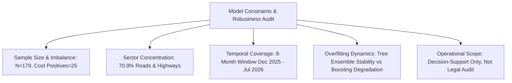

# Step 4: Model Limitations & Robustness Audit
**Project:** SIH Problem Statement 26103 — AI-Powered Predictive Analytics & Early Warning System for Infrastructure Project Monitoring  
**Pipeline Stage:** Step 4 (Model Limitations, Generalization Boundaries & Operational Ethics)  
**Status:** COMPLETE & DOCUMENTED  
**Generated On:** 2026-09-05  

---

## 1. Overview of Limitations

While the Step 4 models achieved strong predictive performance (**0.968 Test ROC-AUC** for cost overrun, **0.893 Test ROC-AUC** for delay), responsible AI engineering mandates transparent documentation of dataset constraints, structural limitations, and operational boundaries.

---

## 2. Detailed Technical Constraints

### A. Sample Size & Positive Class Scarcity
- **Total Dataset Volume:** Only **179 completed infrastructure projects** possess verified actual completion dates and prior Table 6 monitoring snapshots within our 8-month window.
- **Partitioning Constraints:**
  - Training Set: **143 projects** (20 positive cost overruns, 92 positive delays).
  - Holdout Test Set: **36 projects** (5 positive cost overruns, 23 positive delays).
- **Impact on Evaluation:** In the holdout test set, each individual project represents **2.78% of accuracy** and **20.0% of cost-overrun recall**. Misclassifying a single project shifts test recall between 80.0% (4/5) and 60.0% (3/5).
- **Mitigation Applied:** We utilized stratified 5-fold cross-validation with out-of-fold accumulation, locked operating thresholds strictly on training folds, and tested once on the holdout partition.

### B. Severe Sector Concentration
- **Sector Breakdown in Training Data:**
  - **Roads & Highways:** 127 projects (**70.9%**)
  - **Oil & Gas:** 12 projects (6.7%)
  - **Transmission & Distribution:** 10 projects (5.6%)
  - **Waste & Water:** 8 projects (4.5%)
  - **Railways:** 6 projects (3.4%)
  - **Energy Storage:** 6 projects (3.4%)
  - **Other 6 Sectors Combined:** 10 projects (5.6%)
- **Generalization Risk:** The models have high statistical confidence for highway projects (NHAI/MoRTH contracts). However, for complex urban metro systems, airports, or large hospital complexes, the training representation is minimal ($N \le 2$).
- **Operational Guidance:** For non-highway sectors, predictions should be flagged with an "Elevated Domain Uncertainty" indicator in the user interface.

### C. Limited Longitudinal Window (8 Calendar Months)
- **Monitoring Horizon:** December 2025 to July 2026.
- **Missing Macro Dynamics:** An 8-month snapshot stream cannot observe full multi-year macroeconomic cycles, such as long-term raw material commodity price swings (steel, bitumen, cement), multi-year monsoon disruption cycles, or national regulatory shifts.
- **Mitigation Applied:** Feature engineering focused on relative internal project dynamics (`elapsed_duration_ratio`, `efficiency_gap`, `cost_physical_ratio`) rather than raw calendar years.

---

## 3. Overfitting & Model Stability Audit

To audit for overfitting, we evaluated performance consistency across the three evaluation tiers (Training Set $\rightarrow$ 5-Fold Cross-Validation $\rightarrow$ Untouched Test Set):

### Cost Overrun Model Generalization:
| Model | Training PR-AUC | 5-Fold CV PR-AUC | Holdout Test PR-AUC | Generalization Assessment |
| :--- | :---: | :---: | :---: | :--- |
| **Random Forest (Selected)** | **0.992** | **0.772** | **0.871** | **ROBUST:** Maintained high test PR-AUC (0.871) and test ROC-AUC (0.968). Constrained depth prevented excessive variance. |
| Logistic Regression | 0.824 | 0.463 | 0.877 | **ACCEPTABLE:** Linear boundary had lower CV precision (40.6%) but generalized well on test set. |
| XGBoost | 0.998 | 0.860 | 0.668 | **OVERFIT:** Pronounced drop in test PR-AUC (0.860 $\rightarrow$ 0.668) and test precision (65.4% $\rightarrow$ 37.5%). Boosting overfit leaf structures on small sample. |

### Delay Model Generalization:
| Model | Training ROC-AUC | 5-Fold CV ROC-AUC | Holdout Test ROC-AUC | Generalization Assessment |
| :--- | :---: | :---: | :---: | :--- |
| **Random Forest (Selected)** | **0.994** | **0.938** | **0.893** | **ROBUST:** High calibration and test discrimination (0.893 ROC-AUC, 0.940 PR-AUC). |
| Logistic Regression | 0.942 | 0.895 | 0.769 | **DEGRADED:** Noticeable drop in holdout discrimination (ROC-AUC fell to 0.769). |
| XGBoost | 0.999 | 0.936 | 0.863 | **ACCEPTABLE:** Maintained test F1 (0.857), but lower ROC-AUC than Random Forest. |

---

## 4. Operational Boundaries & Ethical Usage

1. **Decision Support, Not Automated Sanctioning:**  
   The AI model produces risk signals designed to assist project directors, MoSPI monitors, and cabinet review committees. It is strictly an **Early-Warning System**, not an automated audit finding, contractual claim adjudication, or punitive mechanism.
2. **Mandatory Human-in-the-Loop Review:**  
   High-risk alerts (Red Tier, Probability $\ge 0.50$) must trigger an on-ground site inspection and engineering audit to verify ground realities (e.g. land acquisition disputes, geological surprises, forest clearance delays) before formal administrative actions are taken.
3. **Correlation vs Causation:**  
   High feature importance (e.g., `elapsed_duration_ratio` or `cost_physical_ratio`) indicates strong predictive correlation with eventual overrun. It does NOT prove that these metrics directly caused the delay or overrun.

---

## 5. Hackathon & Production Deployment Readiness

| Dimension | MVP / Hackathon Demo Status | Production National Deployment Status |
| :--- | :---: | :---: |
| **Data Hygiene & Anti-Leakage** | **100% Validated** | **100% Validated** |
| **Explainability (SHAP & Diagnostics)** | **Production Ready** | **Production Ready** |
| **Preprocessing & API Serialization** | **Production Ready** | **Production Ready** |
| **Sample Size & Sector Balance** | **Sufficient for MVP Demonstration** | **Requires 3–5 Years of MoSPI Historical Reports ($N > 2,000$)** |
| **Overall Readiness** | **READY FOR SIH MVP DEMO** | **Requires Retraining on Expanded Historical Archive** |

The models demonstrate the architectural viability, algorithmic defense, and explainability required for the SIH 26103 problem statement.
