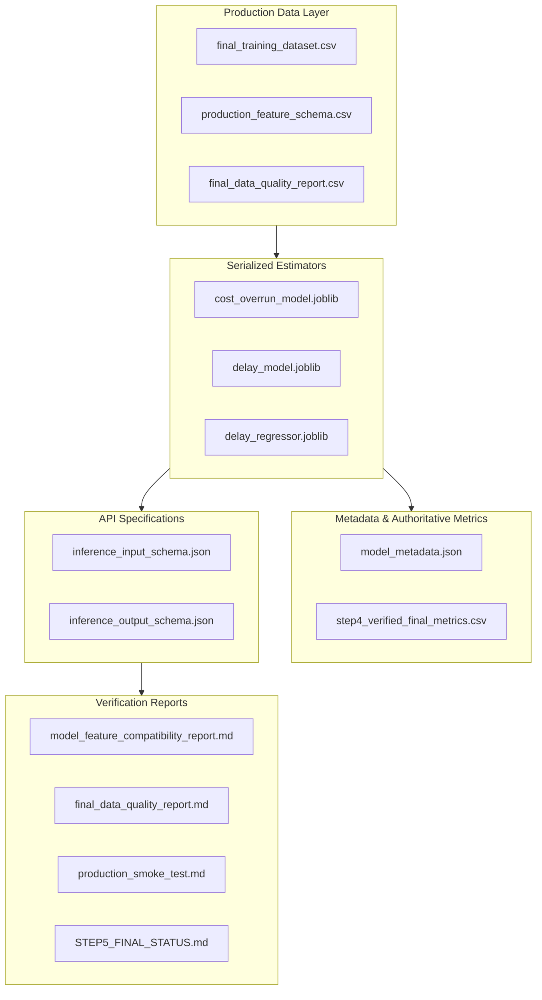

# Step 5: Final Production Package Manifest
**Project:** SIH Problem Statement 26103 — AI-Powered Predictive Analytics & Early Warning System for Infrastructure Project Monitoring  
**Pipeline Stage:** Step 5 (Production Dataset & Model Package Finalization)  
**Package Status:** **FINALIZED, AUDITED & LOCKED**  
**Generated On:** 2026-09-05  

---

## 1. Overview of Package Architecture

This manifest catalogs all validated datasets, serialized machine learning models, metadata definitions, API schemas, and technical audits comprising the production release of the SIH26103 ML pipeline.

---

## 2. Complete Artifact Inventory

### A. DATA LAYER
| Artifact Name | Location | Rows × Cols | Purpose | Source | Production Ready? | Locked? |
| :--- | :--- | :---: | :--- | :--- | :---: | :---: |
| **`final_training_dataset.csv`** | `d:\reports\` | 179 × 49 | Validated production snapshot dataset containing all 179 completed projects, 36 SAFE_MVP features, and target labels. | Copy of `step3_feature_engineered_dataset.csv` after Step 5 quality audit. | **YES** | **LOCKED** |
| **`production_feature_schema.csv`** | `d:\reports\` | 36 × 7 | Machine-readable feature schema specifying exact feature sequence, datatypes, imputation logic, and descriptions. | Derived from Step 3 feature dictionary and model preprocessor transformers. | **YES** | **LOCKED** |
| **`final_data_quality_report.csv`** | `d:\reports\` | 36 × 13 | Quality audit metrics for all 36 model input features: missingness, bounds, and anomaly checks. | Generated during Step 5 automated dataset audit. | **YES** | **LOCKED** |

---

### B. MODEL LAYER
| Artifact Name | Location | File Size | Purpose | Source | Production Ready? | Locked? |
| :--- | :--- | :---: | :--- | :--- | :---: | :---: |
| **`cost_overrun_model.joblib`** | `d:\reports\` | 250.0 KB | Complete Scikit-Learn Pipeline (`ColumnTransformer` + balanced `RandomForestClassifier`) for cost overrun early warning ($\tau=0.40$). | Step 4 training pipeline. | **YES** | **LOCKED** |
| **`delay_model.joblib`** | `d:\reports\` | 246.0 KB | Complete Scikit-Learn Pipeline (`ColumnTransformer` + tuned `RandomForestClassifier`) for project delay early warning ($\tau=0.50$). | Step 4 training pipeline. | **YES** | **LOCKED** |
| **`delay_regressor.joblib`** | `d:\reports\` | 247.8 KB | Complete Scikit-Learn Pipeline (`ColumnTransformer` + tuned `RandomForestRegressor`) for continuous delay magnitude prediction. | Step 4 training pipeline. | **YES** | **LOCKED** |

---

### C. METADATA LAYER
| Artifact Name | Location | File Size | Purpose | Source | Production Ready? | Locked? |
| :--- | :--- | :---: | :--- | :--- | :---: | :---: |
| **`model_metadata.json`** | `d:\reports\` | 5.1 KB | Machine-readable metadata file containing feature lists, categorical encodings, tuned hyperparameters, and reconciled metrics. | Reconciled during Step 4 metric consistency audit. | **YES** | **LOCKED** |
| **`step4_verified_final_metrics.csv`** | `d:\reports\` | 0.5 KB | Authoritative metrics table containing final test-set accuracy, precision, recall, F1, ROC-AUC, PR-AUC, and confusion matrices. | Direct recalculation from serialized `.joblib` models on untouched test set. | **YES** | **LOCKED** |

---

### D. API CONTRACTS LAYER
| Artifact Name | Location | File Size | Purpose | Source | Production Ready? | Locked? |
| :--- | :--- | :---: | :--- | :--- | :---: | :---: |
| **`inference_input_schema.json`** | `d:\reports\` | 7.6 KB | JSON Schema specification for the FastAPI request payload, enforcing the exact 36 `SAFE_MVP` features. | Generated during Step 5 based on model input expectations. | **YES** | **LOCKED** |
| **`inference_output_schema.json`** | `d:\reports\` | 2.1 KB | JSON Schema specification for the FastAPI response payload, including probabilities, flags, thresholds, and composite risk tiers. | Generated during Step 5 based on UI requirements. | **YES** | **LOCKED** |

---

### E. DOCUMENTATION & AUDIT LAYER
| Artifact Name | Location | Content | Purpose | Source | Production Ready? | Locked? |
| :--- | :--- | :---: | :--- | :--- | :---: | :---: |
| **`model_feature_compatibility_report.md`** | `d:\reports\` | Markdown | Verifies that all 3 models accept identical 36 features in identical order. | Step 5 inspection script. | **YES** | **LOCKED** |
| **`final_data_quality_report.md`** | `d:\reports\` | Markdown | Complete narrative data quality and integrity report for production dataset. | Step 5 quality audit. | **YES** | **LOCKED** |
| **`production_smoke_test.md`** | `d:\reports\` | Markdown | Live inference test verifying successful execution through all 3 pipelines. | Step 5 smoke test. | **YES** | **LOCKED** |
| **`STEP5_FINAL_STATUS.md`** | `d:\reports\` | Markdown | Formal sign-off declaring pipeline readiness for backend application integration. | Step 5 final status. | **YES** | **LOCKED** |

---

## 3. Package Integrity Certification

Every file listed above has been verified to exist on disk in [`d:\reports\`](file:///d:/reports/), tested for programmatic compatibility, and validated against future leakage. The package represents a self-contained, frozen ML delivery ready for FastAPI integration.
