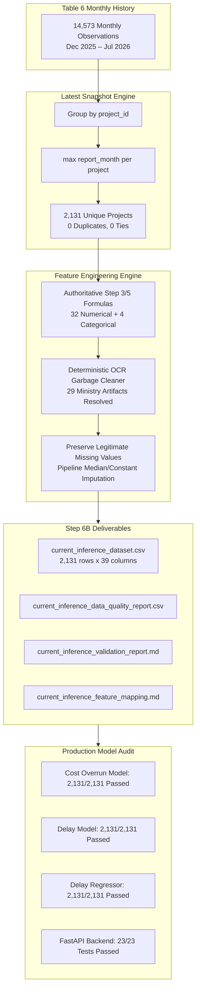

# Step 6B: Build Current Project Inference Dataset — Walkthrough & Verification Report

**Project:** SIH Problem Statement 26103 — AI-Powered Predictive Analytics & Early Warning System for Infrastructure Project Monitoring  
**Pipeline Stage:** Step 6B (Current Project Inference Dataset)  
**Status:** **COMPLETE & FULLY VERIFIED (ALL AUDIT GATES PASSED, 23/23 STEP 6A BACKEND TESTS PASSED)**  

---

## 1. Executive Summary

Step 6B delivers the production-ready `current_inference_dataset.csv`, capturing the latest available monitoring snapshot for every currently monitored infrastructure project in the standardized MoSPI/IPMD Table 6 dataset (**2,131 unique projects**). Every snapshot has been transformed into the exact **36 `SAFE_MVP` features** expected by the trained production ML models without any model retraining, threshold alteration, or backend modification.



---

## 2. Files Created & Modified

| File | Type | Purpose |
| :--- | :--- | :--- |
| [`current_inference_dataset.csv`](file:///d:/SIH26103-Infrastructure-Risk-Prediction/current_inference_dataset.csv) | Primary Dataset | Production inference dataset (2,131 rows $\times$ 39 columns: 3 metadata + 36 model features). |
| [`current_inference_data_quality_report.csv`](file:///d:/SIH26103-Infrastructure-Risk-Prediction/current_inference_data_quality_report.csv) | Audit Report | Tabular quality report tracking missingness, min/median/max distributions, and zero counts. |
| [`current_inference_validation_report.md`](file:///d:/SIH26103-Infrastructure-Risk-Prediction/current_inference_validation_report.md) | Validation Document | In-depth engineering validation report covering snapshot logic, leakage checks, and smoke tests. |
| [`current_inference_feature_mapping.md`](file:///d:/SIH26103-Infrastructure-Risk-Prediction/current_inference_feature_mapping.md) | Technical Specification | Full mathematical and procedural mapping from Table 6 fields to the 36 `SAFE_MVP` features. |
| [`ml/build_current_inference_dataset.py`](file:///d:/SIH26103-Infrastructure-Risk-Prediction/ml/build_current_inference_dataset.py) | Python Script | Reproducible production pipeline script to build the dataset and quality audit. |
| [`ml/generate_reports.py`](file:///d:/SIH26103-Infrastructure-Risk-Prediction/ml/generate_reports.py) | Python Script | Generates validation markdown documentation and feature mapping specifications. |
| [`ml/verify_step6b.py`](file:///d:/SIH26103-Infrastructure-Risk-Prediction/ml/verify_step6b.py) | Python Script | Automated 8-gate verification audit suite. |

---

## 3. Source Data & Cardinality

- **Standardized Source File:** `reports/standardized_table6_project_month.csv`
- **Total Source Observations:** 14,573 monthly project records across 8 reports (`2025-12` to `2026-07`).
- **Unique Projects Identified in Source:** 2,131 projects.
- **Final Current Inference Project Count:** **2,131 snapshots** (1 snapshot per unique project).
- **Duplicate Project Check:** **0 duplicates** (100% unique `project_id`).

### Snapshot Temporal Distribution:
| Report Month | Count | Pct |
| :---: | :---: | :---: |
| 2025-12 | 4 | 0.19% |
| 2026-01 | 8 | 0.38% |
| 2026-02 | 29 | 1.36% |
| 2026-03 | 16 | 0.75% |
| 2026-04 | 29 | 1.36% |
| 2026-05 | 155 | 7.27% |
| 2026-06 | 115 | 5.40% |
| 2026-07 | 1,775 | 83.29% |
| **Total** | **2,131** | **100.00%** |

---

## 4. Feature Schema Verification

The dataset adheres strictly to [`ml/schemas/production_feature_schema.csv`](file:///d:/SIH26103-Infrastructure-Risk-Prediction/ml/schemas/production_feature_schema.csv):

- **Total Features:** 36 features (32 numerical, 4 categorical).
- **Lookup / Identification Columns:** 3 metadata columns (`project_id`, `project_name`, `snapshot_month`).
- **Missing Expected Features:** 0.
- **Extraneous Features:** 0.
- **Feature Order Match:** 100% matched against production schema.

---

## 5. Categorical Cleaning & Missing Value Preservation

### 5.1 Categorical Data Quality
- **Fields Inspected:** `ministry`, `sector`, `implementing_agency`, `state`.
- **Extraction Garbage Detected:** In 29 project snapshots, the raw `ministry` string contained multi-line OCR text copied from the PDF page title and table headers (`All Ongoing Projects\n...`).
- **Deterministic Cleaning Rules:**
  1. *Historical lookup:* Checked project's earlier Table 6 records for a clean ministry (resolved 11 projects).
  2. *Agency mapping:* Mapped known `implementing_agency` to parent ministry using clean Table 6 records and verified administrative ownership (resolved 18 projects).
- **Outcome:** 29/29 garbage records mapped to clean ministries without altering legitimate categories or merging distinct entities.

### 5.2 Missing Value Preservation
- Legitimate missing values in pre-construction gestation (`approval_to_start_months`: 28 missing) and short-term trends (`1_month_change`: 110 missing due to single-month history) are preserved as `NaN`/`None`.
- They are seamlessly handled by the model's locked `SimpleImputer(strategy='median')`.

---

## 6. Model Compatibility & Smoke Test Verification

All 3 production models loaded from disk without modification:
- `cost_overrun_model.joblib`: 2,131/2,131 evaluated successfully.
- `delay_model.joblib`: 2,131/2,131 evaluated successfully.
- `delay_regressor.joblib`: 2,131/2,131 evaluated successfully.

### Smoke Test Table (Representative Projects):
| project_id | Sector / Agency | Cost Overrun Prob | Delay Prob | Predicted Delay (mo) | Status |
| :---: | :--- | :---: | :---: | :---: | :---: |
| **400234** | Railways (`RVNL - II`) | 0.2388 | 0.1615 | -3.83 | **SUCCESS** |
| **400161** | Oil & Gas (`GAIL`) | 0.7201 | 0.1608 | 26.73 | **SUCCESS** |
| **612786** | Aviation (`AAI`) | 0.0804 | 0.2256 | 10.25 | **SUCCESS** |
| **611950** | Transmission (`POWERGRID`) | 0.1571 | 0.0493 | 11.81 | **SUCCESS** |
| **709790** | Oil & Gas (`BPCL`) | 0.0718 | 0.1570 | 0.24 | **SUCCESS** |
| **400152** | Coal (`SECL`) | 0.1518 | 0.2217 | 1.92 | **SUCCESS** |
| **611142** | Inland Waterways (`IWAI`) | 0.6953 | 0.3593 | 34.44 | **SUCCESS** |
| **701586** | Shipping (`MPT`) | 0.1085 | 0.3008 | -15.39 | **SUCCESS** |
| **705503** | Railways (`Central Railway`) | 0.7498 | 0.1671 | 13.74 | **SUCCESS** |
| **400104** | Water Resources (`Water Resources-BR`) | 0.5231 | 0.1451 | 153.04 | **SUCCESS** |

---

## 7. Backend Regression Safety

The complete test suite for Step 6A was re-executed:
```powershell
python -m pytest backend/tests -v
```
**Result: 23 passed in 4.53s** (100% pass rate, zero backend modifications).

---

## 8. Final Verdict

# **`STEP 6B READY FOR REVIEW`**
